# WOONG AI 사용자 매뉴얼

## Warehouse Ops Orchestration & Navigation Governance AI

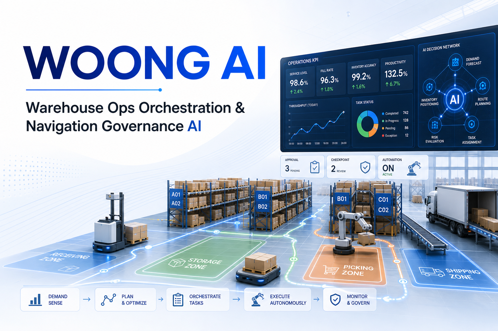

## 문서 정보

| 항목 | 내용 |
|---|---|
| 문서 목적 | WOONG AI 애플리케이션의 화면 구성, 주요 기능, 의사결정 구조, 업무 시나리오, 상태값을 설명한다. |
| 작성 기준 | 현재 구현된 코드와 UI 화면 기준 |
| 작성일 | 2026-07-03 |
| 대상 독자 | 창고 운영자, 관리자, 시연 담당자, 기능 검증 담당자 |
| 원본 형식 | Markdown |
| 최종 산출물 | PDF |

## 작성 기준과 읽는 방법

이 매뉴얼은 사용자가 화면에서 실제로 확인할 수 있는 기능을 중심으로 작성되었다. 단순 조작 설명보다 각 화면이 어떤 정보를 보여주고, 어떤 업무 판단에 사용되는지를 설명하는 데 초점을 둔다.

각 장은 다음 순서로 구성되어 있다.

| 구분 | 설명 |
|---|---|
| 1~10장 | 화면 구성과 기능 설명 |
| 11장 | 의사결정 구조, Agent Pattern, 휴리스틱, 최적화, 시뮬레이션 로직 |
| 12장 | 실제 업무 흐름 기준 시나리오 |
| 13장 | 상태값과 용어 레퍼런스 |

상태값, Action 이름, 데이터셋 이름은 화면과 로그에서 영문 그대로 표시될 수 있으므로 원문 표기를 함께 사용한다.

## 전체 목차

| 장 | 제목 | 주요 내용 |
|---:|---|---|
| 1 | UI 화면 구성 | 전체 레이아웃, 사이드바, 상단 상태 바, 탭, 토스트, 화면 연결 관계 |
| 2 | Agent Chat 화면 | 질문 가능 범위, 예시 답변, 승인 필요 작업, LangGraph 처리 흐름 |
| 3 | 오늘 할 일 패널 | 패널 노출 조건, 4개 업무 버킷, 승인·보류·거절 처리 |
| 4 | KPI Dashboard 화면 | KPI 카드, Zone 점유율, 작업팀 가동률, 지연 추이, 소진 예상 |
| 5 | 운영 데이터 화면 | Snapshot, 기준 데이터, 운영 데이터, 의사결정 데이터, 시뮬레이션 데이터 |
| 6 | Warehouse Simulation 화면 | Baseline, What-if, KPI 비교, 디지털 트윈, Event Timeline |
| 7 | Approval 화면 | Draft 유형, Dry-run, 승인/거절/보류, 발주 이력, 바로 보충 |
| 8 | AI 관측 화면 | Trace 목록, LangGraph 단계, Tool/RAG/Approval Gate 확인 |
| 9 | 실시간 수요 기능 | 실시간 수요 ON/OFF, 설정, 즉시 1건 발생, 자동운영 연계 |
| 10 | 창고 자동운영 화면 | 자동운영 제어, Agent 상태, 요청 생애주기, 로그, 게이트 설정 |
| 11 | 의사결정 구조와 최적화 로직 | LangGraph, Blackboard, Dispatch Score, TSP, Simulation, Trace/Audit |
| 12 | 주요 업무 시나리오 | 오늘 업무 확인, 적치/피킹/출고/발주, 자동운영, What-if, 오류 추적 |
| 13 | 용어와 상태값 | 업무 용어, 상태값, Action, KPI, Simulation, 데이터셋 레퍼런스 |

# 1. UI 화면 구성

WOONG AI는 창고 운영자가 현재 운영 상태를 확인하고, AI에게 업무를 질문하며, 시뮬레이션, 승인, 자동운영까지 한 화면에서 처리할 수 있도록 구성된 웹 애플리케이션이다. 전체 화면은 크게 좌측 사이드바, 상단 상태 바, 중앙 탭 화면, 토스트 알림 영역으로 나뉜다.

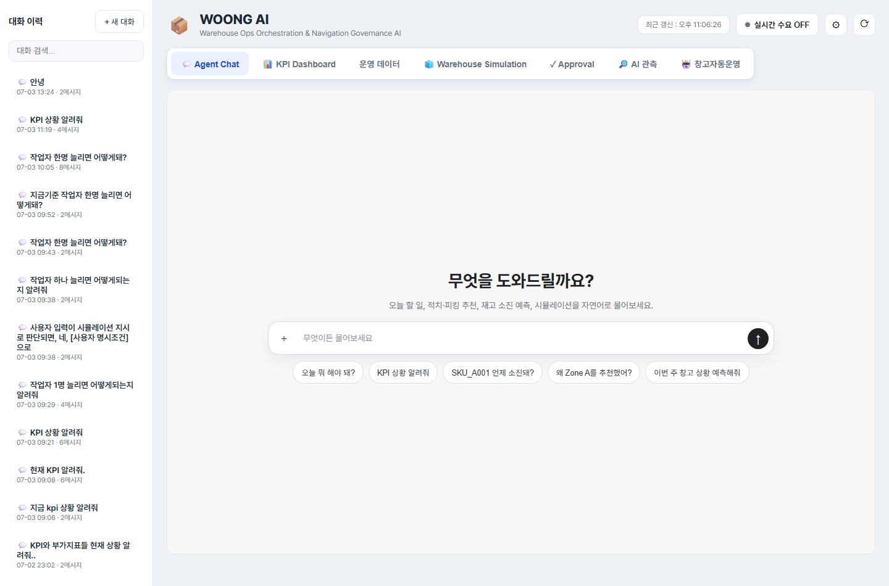

## 1.1 전체 레이아웃

화면의 기본 구조는 다음과 같다.

| 영역 | 역할 |
|---|---|
| 좌측 사이드바 | Agent Chat 대화 세션을 확인하고 새 대화를 시작하는 영역 |
| 상단 상태 바 | 시스템 상태, 최근 갱신 시각, 실시간 수요 기능을 제어하는 영역 |
| 탭 메뉴 | 주요 기능 화면을 전환하는 내비게이션 영역 |
| 중앙 콘텐츠 | 선택한 탭의 실제 기능이 표시되는 작업 영역 |
| 토스트 알림 | 처리 결과, 오류, 실시간 이벤트를 짧게 알려주는 알림 영역 |

사용자는 대부분의 작업을 중앙 콘텐츠에서 수행한다. 상단 상태 바와 좌측 사이드바는 공통 제어 영역으로 항상 유지된다.

## 1.2 좌측 사이드바

좌측 사이드바는 Agent Chat의 대화 이력을 관리하는 영역이다.

주요 구성 요소는 다음과 같다.

| 구성 요소 | 설명 |
|---|---|
| 새 대화 버튼 | 현재 대화와 별개로 새로운 Agent Chat 세션을 시작한다. |
| 세션 검색 | 기존 대화 목록에서 특정 세션을 빠르게 찾을 때 사용한다. |
| 대화 목록 | 이전에 진행한 Agent Chat 세션이 표시된다. |
| 사용자 영역 | 현재 접속 사용자를 표시한다. 기본 사용자는 WOONG Admin으로 표시된다. |

좌측 사이드바에서 세션을 선택하면 해당 대화의 이전 질문과 답변을 다시 불러올 수 있다. Agent Chat은 세션 단위로 대화 맥락을 유지하므로, 이전 질문에서 언급한 주문번호, SKU, 조건 등을 이어서 물어볼 수 있다.

예를 들어 사용자가 먼저 `SKU_A001 언제 소진돼?`라고 질문한 뒤, 이어서 `그거 발주해야 해?`라고 질문하면, 같은 세션 안에서는 이전 질문의 SKU 맥락을 참고할 수 있다.

## 1.3 상단 상태 바

상단 상태 바는 애플리케이션의 공통 상태와 실시간 기능을 제어하는 영역이다.

주요 구성 요소는 다음과 같다.

| 구성 요소 | 설명 |
|---|---|
| WOONG AI 로고/서비스명 | 현재 애플리케이션 이름과 서비스 설명을 표시한다. |
| 최근 갱신 시각 | 화면 데이터가 마지막으로 갱신된 시간을 표시한다. |
| 실시간 수요 ON/OFF | 실시간 입고·출고 수요 생성 기능을 켜거나 끈다. |
| 실시간 수요 설정 | 실시간 수요 생성 주기, 출고 비율, 수량 범위를 설정한다. |
| 새로고침 버튼 | 현재 화면의 데이터를 다시 불러온다. |

`실시간 수요`는 창고 자동운영 기능과 연결된다. 자동운영을 시작하려면 먼저 실시간 수요가 켜져 있어야 한다. 실시간 수요가 꺼져 있으면 자동운영 화면에서 시작을 시도해도 안내 메시지가 표시되고 실행되지 않는다.

## 1.4 탭 메뉴

상단 상태 바 아래에는 주요 기능을 전환하는 탭 메뉴가 있다.

| 탭 | 설명 |
|---|---|
| Agent Chat | 자연어로 창고 운영 상황을 질문하고 AI 답변을 받는 화면이다. |
| KPI Dashboard | 현재 운영 KPI와 추이, 목표 초과 여부를 확인하는 화면이다. |
| 운영 데이터 | 재고, 입고, 출고, 작업, 시뮬레이션 등 원천 데이터를 조회하는 화면이다. |
| Warehouse Simulation | Baseline과 What-if 시뮬레이션을 실행하고 비교하는 화면이다. |
| Approval | AI가 생성한 상태 변경 Draft를 승인·거절·실행하는 화면이다. |
| AI 관측 | Agent Chat의 LangGraph 실행 흐름과 판단 근거를 확인하는 화면이다. |
| 창고 자동운영 | 실시간 수요를 기반으로 Blackboard Agent들이 자동으로 작업을 처리하는 화면이다. |

각 탭은 독립적인 업무 화면으로 구성되어 있지만, 내부 데이터는 서로 연결되어 있다. 예를 들어 Agent Chat에서 생성한 승인 대기 작업은 Approval 탭에서 확인할 수 있고, 자동운영에서 생성된 작업 로그는 운영 데이터 및 창고 자동운영 화면에서 확인할 수 있다.

## 1.5 중앙 콘텐츠 영역

중앙 콘텐츠 영역은 현재 선택한 탭의 실제 기능이 표시되는 영역이다.

예를 들어 `KPI Dashboard` 탭을 선택하면 KPI 카드, Zone 점유율 차트, 작업팀 가동률 추이, 지연 추이, 소진 예상 SKU 목록이 표시된다.

`Warehouse Simulation` 탭을 선택하면 Baseline 정보, What-if 입력 컨트롤, KPI 비교 카드, 디지털 트윈 창고 뷰, Event Timeline이 표시된다.

`창고 자동운영` 탭을 선택하면 자동운영 ON/OFF 상태, Agent 상태, 실시간 요청 목록, 요청 생애주기, 감사 로그, Dispatch 계산 로그, Zone Route 계산 로그, Action 실행 순서 로그가 표시된다.

즉 중앙 콘텐츠 영역은 사용자가 실제로 데이터를 보고 판단하거나, 실행 버튼을 눌러 업무를 처리하는 주 작업 공간이다.

## 1.6 토스트와 알림 안내

WOONG AI는 사용자의 작업 결과나 시스템 이벤트를 화면 우측 하단의 토스트 알림으로 표시한다.

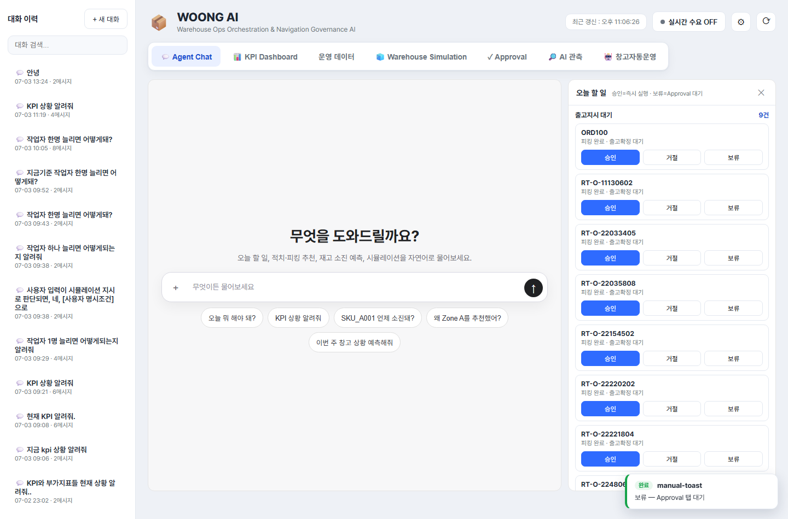

토스트 알림은 다음과 같은 상황에서 나타난다.

| 상황 | 예시 |
|---|---|
| 작업 성공 | 승인·실행 완료, 보류 처리 완료 |
| 작업 실패 | 데이터 조회 실패, 실행 오류, 조건 미충족 |
| 실시간 이벤트 | 실시간 입고·출고 요청 발생 |
| 자동운영 안내 | 자동운영 시작 조건 미충족, 시뮬레이션 대기 |
| Approval 안내 | 보류된 항목이 Approval 탭으로 이동 |

토스트는 사용자가 현재 보고 있는 화면을 방해하지 않도록 짧게 표시된다. 중요한 작업 결과는 토스트뿐 아니라 해당 탭의 목록이나 로그에도 반영된다.

예를 들어 오늘 할 일 패널에서 항목을 `보류`하면 토스트로 보류 처리가 안내되고, 해당 항목은 Approval 탭의 승인 대기 목록에서 다시 확인할 수 있다.

## 1.7 화면 갱신 방식

화면 데이터는 사용자가 직접 새로고침 버튼을 누르거나, 특정 탭에 진입할 때 자동으로 갱신된다.

일부 화면은 주기적으로 데이터를 다시 불러온다. 특히 창고 자동운영 화면은 자동운영 상태, Agent 상태, 요청 목록, 로그를 계속 갱신하여 실시간 처리 흐름을 보여준다.

일반적인 갱신 방식은 다음과 같다.

| 화면 | 갱신 방식 |
|---|---|
| Agent Chat | 질문 전송 시 응답과 Trace가 생성된다. |
| KPI Dashboard | 탭 진입 또는 새로고침 버튼으로 KPI를 다시 조회한다. |
| 운영 데이터 | 데이터셋 선택 또는 새로고침 시 조회한다. |
| Simulation | 실행 버튼을 누르면 새 시뮬레이션 결과가 생성된다. |
| Approval | 탭 진입 또는 승인/거절 처리 후 목록이 갱신된다. |
| AI 관측 | 질문 실행 후 Trace가 추가된다. |
| 창고 자동운영 | 자동운영 상태와 로그가 주기적으로 갱신된다. |

## 1.8 화면 간 연결 관계

WOONG AI의 각 화면은 독립적으로 보이지만 실제 업무 흐름에서는 서로 연결된다.

대표적인 연결 관계는 다음과 같다.

| 시작 화면 | 연결되는 화면 | 설명 |
|---|---|---|
| Agent Chat | Approval | AI가 생성한 Draft를 승인 대기 목록에서 처리한다. |
| Agent Chat | AI 관측 | AI 응답이 어떤 단계로 생성됐는지 Trace로 확인한다. |
| Agent Chat | 오늘 할 일 패널 | 일일 요약 질문 시 처리해야 할 업무 목록을 표시한다. |
| KPI Dashboard | Simulation | KPI 악화 원인을 What-if로 검증할 수 있다. |
| Simulation | KPI Dashboard | 시뮬레이션 결과를 KPI 관점에서 비교한다. |
| 실시간 수요 | 창고 자동운영 | 새 요청이 자동운영 이벤트로 처리된다. |
| 창고 자동운영 | 운영 데이터 | 자동 배정, 경로, 실행 로그가 데이터셋에 기록된다. |

이 구조 때문에 사용자는 단순히 데이터를 조회하는 데서 끝나지 않고, 질문, 판단, 승인, 실행, 검증까지 하나의 흐름으로 업무를 처리할 수 있다.

# 2. Agent Chat 화면

Agent Chat 화면은 사용자가 자연어로 창고 운영 상황을 질문하고, WOONG AI가 현재 운영 데이터, 시뮬레이션 결과, 업무 규칙, RAG 문서 근거를 바탕으로 답변하는 화면이다. 사용 방식은 일반적인 채팅 UI와 유사하므로 별도의 조작 설명보다는 어떤 질문을 할 수 있고, 답변이 어떤 형태로 제공되는지를 이해하는 것이 중요하다.

## 2.1 화면 구성

Agent Chat 화면은 다음 영역으로 구성된다.

| 영역 | 설명 |
|---|---|
| 대화 스레드 | 사용자 질문과 AI 응답이 시간순으로 표시된다. |
| 빈 화면 안내 | 대화가 없는 새 세션에서 질문 가능 주제를 간단히 안내한다. |
| 입력창 | 자연어 질문을 입력하는 영역이다. |
| 전송 버튼 | 입력한 질문을 AI에게 전송한다. |
| 추천 질문 | 자주 사용하는 질문 예시를 버튼으로 제공한다. |
| 오늘 할 일 패널 | 일일 업무 요약 질문이 감지되면 우측에 자동으로 열리는 보조 패널이다. |

대화는 세션 단위로 저장된다. 좌측 사이드바에서 이전 세션을 선택하면 과거 질문과 답변을 다시 확인할 수 있으며, 같은 세션 안에서는 이전 대화의 문맥을 일부 이어서 사용할 수 있다.

## 2.2 질문 가능 범위

Agent Chat은 창고 운영 업무와 관련된 질문에 답변하도록 구성되어 있다. 대표적인 질문 범위는 다음과 같다.

| 구분 | 질문 예시 | 주요 응답 내용 |
|---|---|---|
| 오늘 업무 요약 | `오늘 뭐 해야 돼?` | 출고확정 대기, 피킹지시 대기, 적치지시 대기, 발주 필요 항목 요약 |
| 재고 위험 | `SKU_A001 언제 소진돼?` | 현재 재고, 수요 이력, 예상 소진일, 위험 등급 |
| KPI 현황 | `KPI 상황 알려줘` | Zone 점유율, 작업팀 가동률, 지연 건수, 품절/소진 예상 |
| 적치 추천 | `INB003 적치 위치 추천해줘` | 추천 Location, 추천 사유, 점수 근거, 승인 필요 여부 |
| 피킹 추천 | `오늘 피킹 순서 알려줘` | 우선 처리 주문, 마감 긴급도, 예상 작업시간 |
| 출고/입고 조회 | `오늘 출고 예정 보여줘` | 출고 주문 목록, 상태, 마감 시간 |
| 시뮬레이션 | `작업자 1명 늘리면 어떻게 돼?` | Baseline 대비 What-if KPI 변화 |
| 정책/근거 | `왜 Zone A를 추천했어?` | 운영 규칙, RAG 근거, 계산 결과 요약 |
| 발주/보충 | `부족한 SKU 발주해야 해?` | 필요 발주 수량, 입고 예정, 부족분 |

창고 운영과 무관한 일반 질문은 지원 범위 밖으로 안내될 수 있다. 개인적인 대화나 간단한 인사는 처리할 수 있지만, 시스템의 핵심 목적은 WMS 운영 의사결정 지원이다.

## 2.3 추천 질문

새 대화 화면에는 사용자가 바로 눌러볼 수 있는 추천 질문이 표시된다.

대표 추천 질문은 다음과 같다.

| 추천 질문 | 목적 |
|---|---|
| `오늘 뭐 해야 돼?` | 현재 처리해야 할 업무를 4개 대기 버킷으로 요약한다. |
| `KPI 상황 알려줘` | 현재 운영 KPI와 이상 여부를 확인한다. |
| `SKU_A001 언제 소진돼?` | 특정 SKU의 재고 소진 위험을 확인한다. |
| `왜 Zone A를 추천했어?` | 추천 결과의 정책/계산 근거를 확인한다. |
| `이번 주 창고 상황 예측해줘` | 시뮬레이션 기반 운영 예측을 요청한다. |

추천 질문은 기능을 제한하는 메뉴가 아니라 예시이다. 사용자는 같은 의미의 질문을 자연어로 자유롭게 입력할 수 있다.

## 2.4 예시 질문과 예시 답변

아래 예시는 실제 응답 형식을 설명하기 위한 예시이다. 구체적인 수치와 항목은 현재 데이터 상태에 따라 달라진다.

### 예시 1: 오늘 업무 요약

사용자 질문:

```text
오늘 뭐 해야 돼?
```

예시 답변:

```text
오늘 처리할 작업은 4개 영역으로 정리됩니다.

1. 출고확정 대기: 3건
   - 피킹이 완료되었고 출고확정이 필요한 주문입니다.

2. 피킹지시 대기: 5건
   - 마감 시간이 가까운 주문부터 우선 처리하는 것이 좋습니다.

3. 적치지시 대기: 2건
   - 입고 완료 후 Location 배정이 필요한 건입니다.

4. 부족재고 발주 필요: 4개 SKU
   - 현재 재고와 미처리 출고 수요를 기준으로 발주가 필요한 항목입니다.

우측 오늘 할 일 패널에서 항목별로 승인·실행하거나 Approval 대기로 보류할 수 있습니다.
```

이 질문은 `daily_summary` 의도로 분류되며, 답변 생성 후 우측 `오늘 할 일` 패널이 자동으로 열린다.

### 예시 2: 재고 소진 위험 확인

사용자 질문:

```text
SKU_A001 언제 소진돼?
```

예시 답변:

```text
SKU_A001은 현재 재고와 최근 수요 기준으로 7일 이내 소진 가능성이 있습니다.

- 현재 가용 재고: 120개
- 최근 평균 일 수요: 24개
- 예상 소진 시점: 약 5일 후
- 위험 등급: MEDIUM

입고 예정 수량이 있으면 실제 부족 위험은 낮아질 수 있습니다. 발주 필요 여부는 미처리 출고 수요와 입고 예정까지 함께 확인해야 합니다.
```

재고 위험 질문은 현재 재고, 수요 이력, 안전재고, 미처리 출고 수요, 입고 예정 정보를 함께 고려해 답변한다.

### 예시 3: What-if 시뮬레이션

사용자 질문:

```text
작업자 1명 늘리면 어떻게 돼?
```

예시 답변:

```text
작업자 1명을 추가한 조건으로 7일 What-if 시뮬레이션을 실행했습니다.

| KPI | 현재 기준 | What-if | 증감 |
|---|---:|---:|---:|
| 작업팀 가동률 | 94.0% | 86.5% | -7.5%p |
| 출고지연 건수 | 6.0건 | 3.0건 | -3.0건 |
| 적치지연 건수 | 2.0건 | 1.0건 | -1.0건 |
| 피킹 대기시간 | 42.0분 | 28.0분 | -14.0분 |

작업자 증원은 작업팀 가동률과 피킹 대기시간 개선에 효과가 있습니다. 상세 비교는 Warehouse Simulation 탭에서 What-if 버전을 선택해 확인할 수 있습니다.
```

시뮬레이션 답변은 단순 조언이 아니라 DES 기반 실행 결과를 요약한다. 단, 실행 조건과 결과 수치는 시뮬레이션 입력값과 현재 운영 데이터에 따라 달라진다.

## 2.5 승인 필요 작업이 포함된 답변

Agent Chat은 조회나 분석뿐 아니라 상태 변경이 필요한 작업도 제안할 수 있다. 예를 들어 적치지시 생성, 피킹지시 생성, 출고확정, 발주 생성은 실제 데이터 상태를 바꾸는 작업이다.

이런 작업은 즉시 무조건 실행되지 않고 Draft로 생성된 뒤 승인 절차를 거친다.

대표적인 승인 필요 작업은 다음과 같다.

| 작업 | 설명 |
|---|---|
| 적치지시 생성 | 입고 완료 건을 특정 Location에 적치하도록 작업을 생성한다. |
| 피킹지시 생성 | 출고 주문에 대해 피킹 작업을 생성한다. |
| 출고확정 | 피킹 완료 주문을 출고 완료 상태로 변경하고 재고를 차감한다. |
| 발주 생성 | 부족 SKU에 대한 입고 예정 발주를 생성한다. |

AI 답변 안에 승인 카드가 표시되면 사용자는 해당 작업을 바로 승인하거나 보류할 수 있다. 보류한 작업은 Approval 탭의 승인 대기 목록에서 다시 처리할 수 있다.

## 2.6 Agent Chat 내부 처리 흐름

Agent Chat의 응답은 단순한 문장 생성이 아니라 LangGraph 기반 처리 흐름을 거쳐 생성된다. 상세 구조는 11장에서 별도로 설명하지만, 화면 사용 관점에서는 다음 흐름을 이해하면 충분하다.

| 단계 | 역할 |
|---|---|
| Intent 분류 | 사용자의 질문이 KPI 조회, 재고 위험, 시뮬레이션, 업무 요약 등 어떤 요청인지 판단한다. |
| 파라미터 추출 | SKU, 주문번호, 입고번호, Zone, 날짜, 시뮬레이션 조건 등을 추출한다. |
| Tool 실행 | 데이터 조회, KPI 계산, 추천, 시뮬레이션, Draft 생성 등을 수행한다. |
| RAG 검색 | 정책, SOP, 규칙 설명이 필요한 경우 문서 근거를 검색한다. |
| 응답 생성 | Tool 결과와 문서 근거를 사용자가 이해할 수 있는 답변으로 정리한다. |
| Approval Gate | 상태 변경 작업이 포함되어 있으면 승인 필요 여부를 판단한다. |

이 흐름은 `AI 관측` 탭에서 Trace로 확인할 수 있다. 따라서 AI가 어떤 의도로 질문을 해석했고, 어떤 Tool을 실행했으며, 왜 승인 필요 작업으로 판단했는지를 추적할 수 있다.

# 3. 오늘 할 일 패널

오늘 할 일 패널은 Agent Chat 화면의 우측에 표시되는 업무 처리 보조 패널이다. 사용자가 일일 업무 요약을 요청했을 때 현재 처리해야 할 작업을 4개 버킷으로 정리하고, 각 항목을 바로 승인·실행하거나 Approval 대기로 보류할 수 있게 해준다.

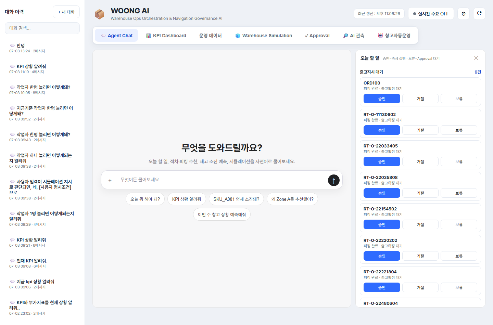

## 3.1 패널이 열리는 조건

오늘 할 일 패널은 사용자가 Agent Chat에서 오늘 처리할 업무를 묻는 질문을 했을 때 자동으로 열린다.

대표적인 질문은 다음과 같다.

```text
오늘 뭐 해야 돼?
```

```text
오늘 처리할 일 정리해줘
```

```text
입고 쪽 대기 업무만 요약해줘
```

```text
피킹 쪽 할 일 알려줘
```

시스템 내부에서는 이런 질문이 `daily_summary` 의도로 분류된다. Agent Chat 응답이 완료된 뒤 의도가 `daily_summary`이면 우측 오늘 할 일 패널이 자동으로 열리고, `/todo` 데이터를 조회해 4개 대기 버킷을 표시한다.

패널은 사용자가 직접 닫을 수 있다. 닫은 뒤에도 다시 일일 요약 질문을 하면 패널이 다시 열린다.

## 3.2 패널 구성

오늘 할 일 패널은 다음 4개 버킷으로 구성된다.

| 버킷 | 의미 | 연결 작업 |
|---|---|---|
| 출고확정 대기 | 피킹이 완료되어 출고확정이 필요한 주문 | 출고확정 Draft 생성 및 실행 |
| 피킹지시 대기 | 피킹 작업 지시가 필요한 출고 주문 | 피킹지시 Draft 생성 및 실행 |
| 적치지시 대기 | 입고 완료 후 적치 Location 배정이 필요한 입고 건 | 적치지시 Draft 생성 및 실행 |
| 부족재고 발주 필요 | 현재 재고와 미처리 수요 기준으로 발주가 필요한 SKU | 발주 Draft 생성 및 실행 |

각 버킷에는 상위 항목이 먼저 표시된다. 항목이 많으면 `더보기` 버튼을 통해 추가 목록을 불러올 수 있다.

## 3.3 출고확정 대기

출고확정 대기 버킷은 피킹이 완료되었지만 아직 출고확정이 처리되지 않은 주문을 보여준다.

표시되는 항목은 보통 주문번호를 중심으로 구성된다. 사용자가 승인하면 출고확정 Draft가 생성되고 즉시 실행되어 주문 상태가 출고 완료로 변경된다. 이 과정에서 출고 수량만큼 재고가 차감되고, 출고 대기 상태도 처리 완료로 변경된다.

이 버킷은 출고 마감 지연을 줄이는 데 중요하다. 피킹이 끝났는데 출고확정이 지연되면 KPI상 출고지연 또는 출고 대기 건수에 영향을 줄 수 있다.

## 3.4 피킹지시 대기

피킹지시 대기 버킷은 아직 피킹 작업이 발행되지 않은 출고 주문을 보여준다.

피킹 우선순위는 마감 시간, 고객 우선순위, 재고 위험, 예상 작업시간 등을 고려해 추천된다. 사용자가 승인하면 피킹지시 Draft가 생성되고 실행된다. 실행 과정에서는 출고 주문에 대한 재고 할당이 함께 수행되며, 피킹 작업이 생성된다.

피킹지시 실행 후에는 해당 주문이 출고확정 대기 단계로 이어질 수 있다.

## 3.5 적치지시 대기

적치지시 대기 버킷은 입고가 완료되었지만 아직 창고 Location에 적치되지 않은 입고 건을 보여준다.

사용자가 승인하면 시스템은 적치 추천 로직을 통해 적절한 Location을 찾고, 해당 위치에 적치지시 Draft를 생성한 뒤 실행한다. 적치 위치는 보관 유형, Zone 상태, 여유 용량, 출고 수요와의 연계 등을 고려해 추천된다.

적치가 지연되면 가용재고 반영이 늦어지고, 출고 주문 처리에도 영향을 줄 수 있다.

## 3.6 부족재고 발주 필요

부족재고 발주 필요 버킷은 현재 재고, 미처리 출고 수요, 안전재고, 입고 예정 정보를 기준으로 추가 발주가 필요한 SKU를 보여준다.

표시되는 항목에는 SKU와 필요 발주 수량이 포함된다. 사용자가 승인하면 발주 Draft가 생성되고 실행되어 신규 입고 예정 건이 만들어진다.

발주가 실행되었다고 즉시 가용재고가 증가하는 것은 아니다. 발주 실행은 입고 예정 데이터를 생성하는 단계이며, 실제 가용재고 증가는 입고 및 적치가 완료된 뒤 반영된다.

## 3.7 항목별 버튼 동작

각 할 일 항목에는 다음 버튼이 표시된다.

| 버튼 | 동작 |
|---|---|
| 승인 | 해당 항목에 맞는 Draft를 생성하고 즉시 승인·실행한다. |
| 거절 | 현재 패널 목록에서 해당 항목을 제외한다. 데이터 상태를 변경하지 않는다. |
| 보류 | 해당 항목에 맞는 Draft를 생성하되 실행하지 않고 Approval 탭의 승인 대기 상태로 남긴다. |

`승인`을 누르면 처리 결과가 토스트로 표시되고, 항목에는 `승인·실행됨` 상태가 표시된다.

`보류`를 누르면 처리 결과가 토스트로 표시되고, 항목에는 `보류(Approval 대기)` 상태가 표시된다. 이후 Approval 탭에서 해당 Draft를 다시 검토하고 승인 또는 거절할 수 있다.

`거절`은 현재 패널에서 항목을 제거하는 동작이다. 이 버튼은 Approval 거절과 다르며, 실제 Draft를 생성하거나 데이터 상태를 변경하지 않는다.

## 3.8 Approval 탭과의 연결

오늘 할 일 패널의 `보류` 동작은 Approval 탭과 직접 연결된다.

보류 시 처리 흐름은 다음과 같다.

1. 사용자가 오늘 할 일 패널에서 항목의 `보류` 버튼을 누른다.
2. 시스템이 해당 업무 유형에 맞는 Draft를 생성한다.
3. Draft 상태는 `PENDING_APPROVAL`로 저장된다.
4. 화면에는 `보류(Approval 대기)` 상태가 표시된다.
5. 사용자는 Approval 탭에서 해당 Draft를 다시 확인하고 승인 또는 거절한다.

이 구조는 즉시 실행하기에는 부담이 있는 작업을 따로 모아 검토할 수 있게 해준다. 특히 발주, 출고확정처럼 재고나 주문 상태를 바꾸는 작업은 보류 후 Approval 탭에서 Dry-run 결과를 확인하고 처리하는 방식이 유용하다.

## 3.9 더보기와 목록 갱신

오늘 할 일 패널은 각 버킷별로 기본 목록을 먼저 표시한다. 항목 수가 기본 표시 수보다 많으면 `더보기` 버튼이 나타난다.

`더보기`를 누르면 해당 버킷의 다음 항목을 추가로 불러온다. 이때 기존 목록은 유지되고 새 항목이 아래에 추가된다.

패널이 처음 열릴 때는 `/todo` 데이터를 새로 조회한다. 따라서 같은 질문을 다시 하거나 패널을 다시 열면 현재 데이터 기준으로 할 일 목록이 다시 구성된다.

## 3.10 사용 시 주의사항

오늘 할 일 패널은 업무를 빠르게 처리하기 위한 실행 보조 화면이다. 따라서 다음 사항을 유의해야 한다.

| 항목 | 주의사항 |
|---|---|
| 승인 | 즉시 실행되므로 상태 변경이 발생한다. |
| 보류 | Draft가 생성되어 Approval 탭에 남는다. 이후 별도 처리가 필요하다. |
| 거절 | 현재 패널 목록에서만 제외되며, 실제 업무 데이터가 거절 상태로 저장되는 것은 아니다. |
| 발주 | 발주 실행은 입고 예정 생성이며, 즉시 가용재고 증가가 아니다. |
| 피킹지시 | 실행 시 재고 할당과 피킹 작업 생성이 함께 수행될 수 있다. |
| 출고확정 | 실행 시 재고 차감이 발생할 수 있다. |

오늘 할 일 패널은 Agent Chat의 일일 요약 답변과 함께 사용하는 것이 가장 자연스럽다. AI가 전체 업무 상황을 먼저 요약하고, 사용자는 패널에서 항목별로 즉시 실행할지 보류할지 선택한다.

# 4. KPI Dashboard 화면

KPI Dashboard 화면은 현재 창고 운영 상태를 핵심 지표로 요약해 보여주는 화면이다. 사용자는 이 화면에서 Zone 공간 상태, 작업팀 부하, 출고·적치 지연, 품절 위험, 재고금액을 한 번에 확인할 수 있다.

KPI Dashboard는 실제 운영 데이터 기준으로 계산되며, 화면 상단에는 기준일이 표시된다. 기준일은 현재 KPI가 어떤 운영 데이터 시점을 기준으로 산출되었는지 알려준다.

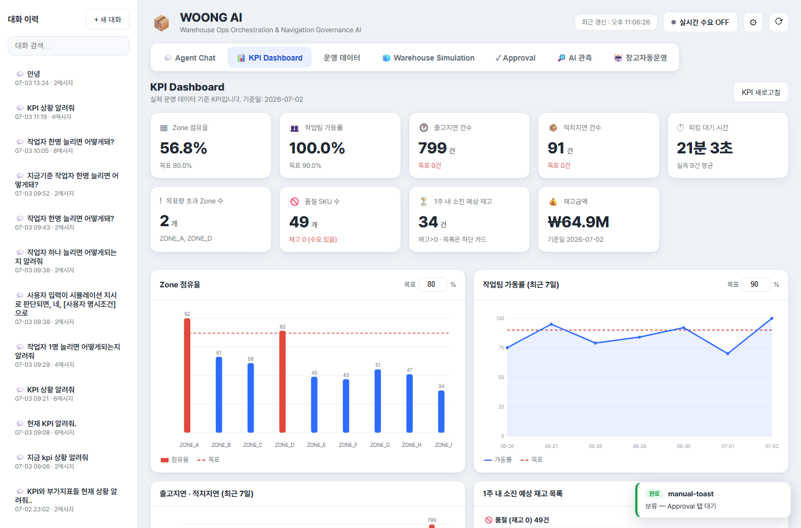

## 4.1 화면 구성

KPI Dashboard는 다음 영역으로 구성된다.

| 영역 | 설명 |
|---|---|
| 화면 제목 영역 | `KPI Dashboard` 제목과 기준일 안내, `KPI 새로고침` 버튼이 표시된다. |
| KPI 카드 영역 | 주요 KPI 9개를 카드 형태로 표시한다. |
| Zone 점유율 차트 | Zone별 점유율과 목표선을 비교한다. |
| 작업팀 가동률 추이 | 최근 7일 작업팀 가동률 추이를 표시한다. |
| 출고·적치 지연 추이 | 최근 7일 출고지연과 적치지연 건수를 표시한다. |
| 소진 예상 재고 목록 | 품절 SKU와 1주 내 소진 예상 SKU를 표로 표시한다. |

사용자는 `KPI 새로고침` 버튼을 눌러 현재 데이터를 다시 조회할 수 있다.

## 4.2 KPI 카드 구성

KPI 카드 영역에는 다음 지표가 표시된다.

| KPI | 의미 | 해석 기준 |
|---|---|---|
| Zone 점유율 | 전체 Zone의 평균 재고 점유율 | 목표 점유율보다 높으면 공간 과부하 가능성이 있다. |
| 작업팀 가동률 | 작업자와 지게차로 구성된 작업팀의 사용률 | 목표보다 과도하게 높으면 작업 병목 가능성이 있다. |
| 출고지연 건수 | 출고 마감 또는 처리 기준을 넘긴 주문 수 | 목표는 0건이다. |
| 적치지연 건수 | 입고 후 적치가 지연된 건수 | 목표는 0건이다. |
| 피킹 대기 시간 | 피킹 작업이 시작되기 전까지의 평균 대기 시간 | 대기 시간이 길수록 출고 리드타임이 늘어난다. |
| 목표량 초과 Zone 수 | 설정된 목표 점유율을 초과한 Zone 개수 | 초과 Zone이 많으면 적치 전략 조정이 필요하다. |
| 품절 SKU 수 | 재고가 0이고 수요가 있는 SKU 수 | 즉시 보충 또는 발주 검토가 필요하다. |
| 1주 내 소진 예상 재고 | 현재고가 있으나 7일 내 소진될 것으로 예상되는 SKU 수 | 선제 발주 또는 보충 검토 대상이다. |
| 재고금액 | 현재 보유 재고의 금액 환산값 | 재고 규모와 자산 부담을 확인한다. |

KPI 카드는 현재 값뿐 아니라 목표값, 기준일, 대기 건수, 초과 Zone 목록 등 보조 정보를 함께 표시한다.

## 4.3 Zone 점유율

Zone 점유율은 각 Zone의 최대 수용량 대비 현재 재고량 비율을 의미한다.

화면에서는 Zone별 점유율이 막대 차트로 표시되고, 설정된 목표 점유율이 기준선으로 함께 표시된다. 특정 Zone의 막대가 목표선을 넘으면 공간 과부하 가능성이 있다는 의미이다.

점유율이 높은 Zone은 다음 문제를 유발할 수 있다.

| 문제 | 설명 |
|---|---|
| 적치 지연 | 여유 공간 부족으로 적치 위치 추천이 어려워질 수 있다. |
| 피킹 동선 악화 | 특정 Zone에 작업이 몰리면 작업 대기 시간이 늘어날 수 있다. |
| 자동운영 차단 | 자동운영에서 공간 게이트가 과부하로 판단하면 일부 Action이 차단될 수 있다. |

목표 점유율은 화면의 `목표` 입력값으로 조정할 수 있다. 값을 변경하면 KPI 목표 설정에 저장되고, 이후 차트와 KPI 카드에서 동일한 기준으로 사용된다.

## 4.4 작업팀 가동률

작업팀 가동률은 작업자와 지게차를 조합해 구성한 작업팀이 얼마나 사용되고 있는지를 나타낸다.

작업팀은 단순히 작업자 수만으로 계산되지 않는다. 일반적으로 작업자 2명과 지게차 1대를 하나의 작업팀으로 보고, 사용 가능한 작업팀 수는 작업자 수와 지게차 수 중 더 제한적인 요소에 의해 결정된다.

작업팀 가동률이 높다는 것은 현재 작업량이 가용 작업팀에 비해 많다는 뜻이다.

| 상태 | 해석 |
|---|---|
| 목표 이하 | 현재 인력·장비로 처리 가능한 수준이다. |
| 목표 근접 | 병목이 발생하기 전 단계일 수 있다. |
| 목표 초과 | 작업 지연, 피킹 대기, 출고 지연으로 이어질 수 있다. |

작업팀 가동률의 목표값도 화면에서 조정할 수 있다. 변경된 목표값은 최근 7일 추이 차트의 기준선으로도 사용된다.

## 4.5 출고지연, 적치지연, 피킹 대기시간

KPI Dashboard는 작업 지연과 관련된 지표를 함께 보여준다.

| 지표 | 의미 |
|---|---|
| 출고지연 건수 | 출고가 제때 완료되지 못한 주문 수 |
| 적치지연 건수 | 입고 후 적치 작업이 지연된 건수 |
| 피킹 대기 시간 | 피킹 작업이 시작되기까지 기다린 평균 시간 |

출고지연과 적치지연은 최근 7일 추이 차트로도 표시된다. 사용자는 특정 날짜에 지연이 증가했는지, 출고지연과 적치지연 중 어떤 문제가 더 큰지 비교할 수 있다.

피킹 대기 시간은 피킹 작업의 병목을 판단하는 데 사용된다. 대기 시간이 길면 피킹지시가 늦게 발행되었거나, 작업팀이 부족하거나, 특정 Zone에 작업이 몰렸을 가능성이 있다.

## 4.6 품절 SKU 및 1주 내 소진 예상

하단의 재고 목록은 두 영역으로 나뉜다.

| 영역 | 설명 |
|---|---|
| 품절 | 현재 재고가 0이고 수요가 있는 SKU 목록 |
| 1주 내 소진 예상 | 현재 재고는 있으나 7일 내 소진될 것으로 예상되는 SKU 목록 |

품절 목록에는 SKU와 일평균 소진량이 표시된다. 1주 내 소진 예상 목록에는 SKU, 현재고, 일평균 소진량, 소진까지 남은 일수가 표시된다.

이 목록은 발주 또는 보충 우선순위를 판단할 때 사용한다. 특히 현재 재고가 0인 SKU와 1주 내 소진 SKU는 오늘 할 일 패널의 `부족재고 발주 필요` 항목과 연결될 수 있다.

## 4.7 KPI 목표값 설정

KPI Dashboard에서 직접 조정할 수 있는 목표값은 다음과 같다.

| 목표값 | 입력 위치 | 영향 |
|---|---|---|
| Zone 점유율 목표 | Zone 점유율 차트 상단 | 초과 Zone 판단 기준으로 사용된다. |
| 작업팀 가동률 목표 | 작업팀 가동률 차트 상단 | 가동률 추이의 기준선으로 사용된다. |

목표값은 퍼센트 단위로 입력한다. 예를 들어 Zone 점유율 목표를 `80`으로 입력하면 80%를 기준으로 초과 여부를 판단한다.

목표값은 단순 화면 표시용이 아니라 KPI 해석과 일부 자동운영 판단의 기준값으로도 활용될 수 있다.

## 4.8 KPI Dashboard 사용 시나리오

KPI Dashboard는 다음 상황에서 주로 사용한다.

| 상황 | 확인할 항목 |
|---|---|
| 창고가 혼잡한지 확인 | Zone 점유율, 목표 초과 Zone 수 |
| 인력·장비가 부족한지 확인 | 작업팀 가동률, 피킹 대기 시간 |
| 출고 문제가 있는지 확인 | 출고지연 건수, 출고지연 추이 |
| 입고 후 적치가 밀리는지 확인 | 적치지연 건수, 적치지연 추이 |
| 발주가 필요한지 확인 | 품절 SKU, 1주 내 소진 예상 목록 |
| What-if가 필요한지 판단 | KPI 악화 지표를 확인한 뒤 Warehouse Simulation에서 자원 증감 효과 검증 |

# 5. 운영 데이터 화면

운영 데이터 화면은 WOONG AI가 사용하는 원천 데이터를 조회하는 화면이다. KPI, Agent Chat, Approval, Simulation, 자동운영 화면에서 보여주는 결과가 어떤 데이터에 기반하는지 확인할 수 있다.

이 화면은 운영자뿐 아니라 관리자, 검증 담당자, 시연 준비자가 데이터 상태를 점검할 때 유용하다.

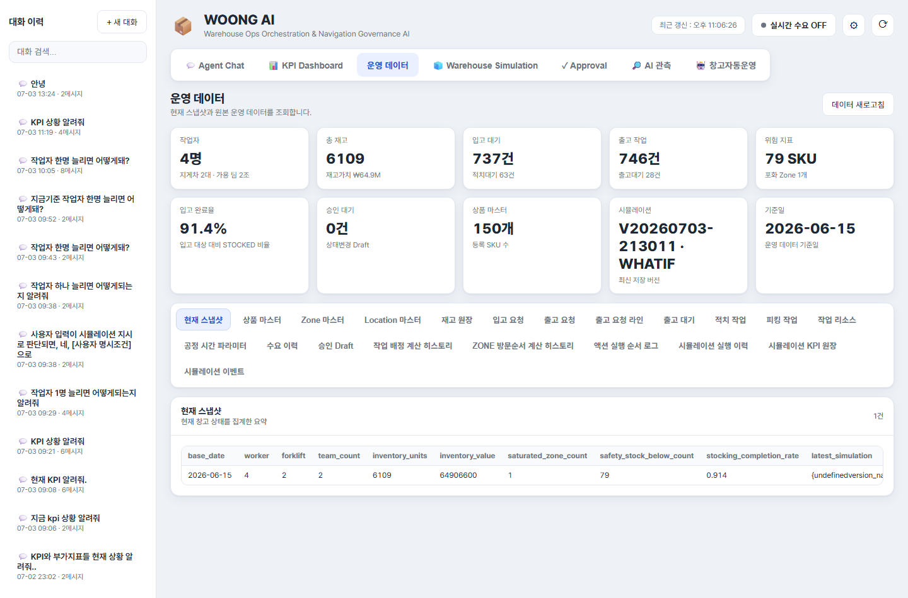

## 5.1 화면 구성

운영 데이터 화면은 다음 영역으로 구성된다.

| 영역 | 설명 |
|---|---|
| 화면 제목 영역 | `운영 데이터` 제목과 `데이터 새로고침` 버튼이 표시된다. |
| Snapshot 카드 | 현재 운영 상태를 요약한 카드 목록이다. |
| 데이터셋 탭 | 조회할 원천 데이터 종류를 선택한다. |
| 원본 데이터 표 | 선택한 데이터셋의 행 데이터를 표 형태로 표시한다. |

데이터셋 탭을 선택하면 하단 원본 데이터 표가 해당 데이터셋으로 갱신된다.

## 5.2 Snapshot 카드

Snapshot은 현재 운영 상태를 빠르게 파악하기 위한 요약 영역이다.

표시되는 대표 항목은 다음과 같다.

| 카드 | 설명 |
|---|---|
| 작업자 | 현재 작업자 수, 지게차 수, 가용 작업팀 수 |
| 총 재고 | 전체 재고 수량과 재고가치 |
| 입고 대기 | 입고 예정 또는 입고 완료 후 적치 대기 건수 |
| 출고 작업 | 출고 예정 주문과 출고 대기 건수 |
| 위험 지표 | 안전재고 미달 SKU와 포화 Zone 수 |
| 입고 완료율 | 입고 대상 대비 완료 비율 |
| 승인 대기 | Approval 대기 중인 Draft 수 |
| 상품 마스터 | 등록된 SKU 수 |
| 시뮬레이션 | 최신 저장 시뮬레이션 버전 |
| 기준일 | 운영 데이터 기준일 |

Snapshot은 여러 탭에 흩어진 정보를 한 화면에서 확인하기 위한 요약이다.

## 5.3 기준 데이터

기준 데이터는 운영 판단의 기준이 되는 마스터성 데이터이다.

| 데이터셋 | 설명 |
|---|---|
| 상품 마스터 | SKU, 상품명, 카테고리, 보관 유형, 안전재고, 단가 등을 관리한다. |
| Zone 마스터 | Zone ID, Zone명, 보관 유형, 게이트 거리, 피킹 우선순위, 최대 용량을 관리한다. |
| Location 마스터 | 실제 적치 위치, 소속 Zone, 용량, 현재 점유 수량, 위치 역할을 관리한다. |
| 작업 리소스 | 작업자, 지게차 등 리소스 ID와 활성 상태를 관리한다. |
| 공정 시간 파라미터 | 입고, 적치, 피킹, 포장/출고 단계별 처리 시간 분포를 관리한다. |

기준 데이터는 추천, 시뮬레이션, KPI 계산의 기본 입력으로 사용된다.

## 5.4 운영 데이터

운영 데이터는 현재 창고에서 실제로 처리 중인 업무 상태를 나타낸다.

| 데이터셋 | 설명 |
|---|---|
| 재고 저장 | SKU, LOT, Location, 수량, 입고일, 유통기한, 상태를 조회한다. |
| 입고 요청 | 입고번호, SKU, 수량, 예정일, 입고 상태, 공급처를 조회한다. |
| 출고 요청 | 주문번호, 고객, 우선순위, 마감 시간, 출고 상태를 조회한다. |
| 출고 요청 라인 | 출고 주문에 포함된 SKU별 수량, 할당 수량, 피킹 수량, 출고 수량을 조회한다. |
| 출고 대기 | 피킹 완료 후 출고확정을 기다리는 주문을 조회한다. |
| 수요 이력 | SKU별 과거 출고 수요를 조회한다. |

이 데이터는 Agent Chat의 조회 답변, KPI Dashboard의 지표 계산, 오늘 할 일 패널의 업무 목록 생성에 사용된다.

## 5.5 작업 데이터

작업 데이터는 실제 작업 지시와 처리 상태를 보여준다.

| 데이터셋 | 설명 |
|---|---|
| 적치 작업 | 입고 건을 특정 Location에 적치하도록 발행된 작업이다. |
| 피킹 작업 | 출고 주문을 처리하기 위해 발행된 피킹 작업이다. |

적치 작업과 피킹 작업은 Approval 승인, 오늘 할 일 승인, 자동운영 실행에 의해 생성될 수 있다.

## 5.6 의사결정 데이터

의사결정 데이터는 AI와 자동운영이 어떤 판단을 했는지 확인하기 위한 데이터이다.

| 데이터셋 | 설명 |
|---|---|
| Approval Draft | 승인 대기, 실행 완료, 거절된 상태 변경 작업을 조회한다. |
| Dispatch Score | 자동운영에서 작업 후보별 배정 점수와 배정/스킵 사유를 기록한다. |
| Zone Route | 피킹 작업의 Zone 방문순서 계산 결과를 기록한다. |
| Action Execution Log | 자동운영 사이클에서 Action이 어떤 순서로 실행되었는지 기록한다. |

이 데이터는 단순 조회용을 넘어 AI 판단 근거와 자동운영 실행 검증에 사용된다.

## 5.7 시뮬레이션 데이터

시뮬레이션 데이터는 Warehouse Simulation 화면에서 생성된 결과를 조회하는 영역이다.

| 데이터셋 | 설명 |
|---|---|
| Simulation Runs | Baseline 또는 What-if 실행 이력, 조건, 버전명, 생성 시각을 조회한다. |
| Simulation KPIs | 시뮬레이션 실행별 KPI 산출값을 조회한다. |
| Simulation Events | 시뮬레이션 중 발생한 병목, 지연, 소진 등 이벤트를 조회한다. |

Simulation Runs는 버전 비교의 기준이 된다. Simulation KPIs와 Events는 화면의 KPI 카드, 추이 차트, Event Timeline에 사용된다.

## 5.8 원본 데이터 표

데이터셋을 선택하면 하단에 원본 데이터 표가 표시된다.

표 상단에는 다음 정보가 표시된다.

| 항목 | 설명 |
|---|---|
| 데이터셋 제목 | 현재 선택한 데이터셋의 이름 |
| 데이터셋 설명 | 해당 데이터셋이 어떤 의미인지 설명 |
| 전체 건수 | 조회 가능한 전체 행 수 |
| 실시간 자동갱신 여부 | 실시간 수요가 켜진 상태에서 일부 데이터셋은 자동 갱신 상태가 표시될 수 있다. |

긴 값이나 JSON 형태의 값은 표 안에서 축약되어 표시될 수 있다. 상세 검증이 필요한 경우 데이터셋 의미와 ID를 기준으로 관련 화면 또는 DB 레코드를 함께 확인한다.

# 6. Warehouse Simulation 화면

Warehouse Simulation 화면은 현재 창고 운영 상태를 기준으로 미래 운영 상황을 예측하고, 작업자나 지게차 수를 바꿨을 때 KPI가 어떻게 변하는지 비교하는 화면이다.

이 화면의 핵심은 `현재 운영 기준(Baseline)`과 `What-if 조건`을 분리해 비교하는 것이다.

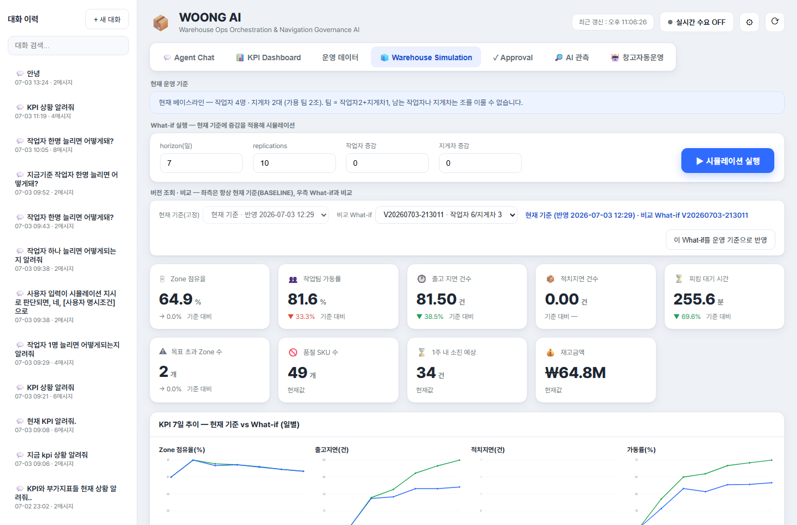

## 6.1 화면 구성

Warehouse Simulation 화면은 다음 영역으로 구성된다.

| 영역 | 설명 |
|---|---|
| 현재 운영 기준 | 현재 Baseline 버전과 반영 시각을 표시한다. |
| What-if 실행 조건 | horizon, replications, 작업자 증감, 지게차 증감을 입력한다. |
| 버전 조회·비교 | 현재 Baseline과 선택한 What-if 버전을 비교한다. |
| KPI 카드 | 시뮬레이션 결과 KPI와 Baseline 대비 변화를 표시한다. |
| KPI 7일 추이 | Baseline과 What-if의 일별 KPI 흐름을 비교한다. |
| 디지털 트윈 | 창고 Zone과 작업팀 움직임을 시각적으로 표시한다. |
| Event Timeline | 시뮬레이션 중 발생한 이벤트를 시간순으로 표시한다. |

## 6.2 현재 운영 기준 Baseline

Baseline은 현재 운영 기준을 나타내는 시뮬레이션 버전이다. 화면에서는 좌측 비교 기준이 항상 Baseline으로 고정된다.

Baseline은 다음 용도로 사용된다.

| 용도 | 설명 |
|---|---|
| 현재 상태 예측 | 현재 자원과 운영 데이터를 기준으로 미래 KPI를 예측한다. |
| What-if 비교 기준 | 작업자나 지게차를 바꾼 결과와 비교한다. |
| 운영 기준 반영 | 선택한 What-if 조건을 운영 기준으로 반영하면 새 Baseline이 생성된다. |

Baseline이 없으면 최초 시뮬레이션 실행을 통해 기준 버전이 생성된다.

## 6.3 What-if 입력값

What-if 실행 영역에서는 다음 값을 입력한다.

| 입력값 | 설명 |
|---|---|
| horizon(일) | 며칠 뒤까지 예측할지 지정한다. |
| replications | 시뮬레이션 반복 횟수이다. 반복 횟수가 많을수록 결과 안정성이 높아질 수 있다. |
| 작업자 증감 | 현재 작업자 수에서 몇 명을 늘리거나 줄일지 입력한다. |
| 지게차 증감 | 현재 지게차 수에서 몇 대를 늘리거나 줄일지 입력한다. |

작업자 증감과 지게차 증감이 모두 0이면 현재 운영과 동일한 조건이므로 What-if 실행이 제한된다. 이 경우 토스트 알림으로 조건을 변경하라는 안내가 표시된다.

## 6.4 시뮬레이션 실행

`시뮬레이션 실행` 버튼을 누르면 입력한 조건으로 DES 기반 시뮬레이션이 실행된다.

실행 결과는 다음 흐름으로 반영된다.

1. 현재 Baseline을 기준으로 비교 조건을 구성한다.
2. 작업자 또는 지게차 증감 조건을 적용한다.
3. 시뮬레이션을 실행하고 What-if 버전을 저장한다.
4. 버전 목록에 새 What-if가 추가된다.
5. 화면은 Baseline과 방금 실행한 What-if를 비교 대상으로 표시한다.

시뮬레이션 실행 중에는 버튼이 비활성화되고 `실행 중...` 상태로 표시된다.

## 6.5 KPI 카드 해석

시뮬레이션 결과 KPI 카드는 운영 KPI와 유사하지만, 실제 현재값이 아니라 예측 결과를 보여준다.

대표 KPI는 다음과 같다.

| KPI | 의미 |
|---|---|
| Zone 점유율 | 시뮬레이션 기간 동안의 예상 공간 점유율 |
| 작업팀 가동률 | 작업자·지게차 조합 기준 예상 가동률 |
| 출고지연 건수 | 시뮬레이션 기간 중 예상 출고 지연 건수 |
| 적치지연 건수 | 시뮬레이션 기간 중 예상 적치 지연 건수 |
| 피킹 대기 시간 | 예상 피킹 대기 시간 |
| 목표 초과 Zone 수 | 목표 점유율을 초과할 것으로 예상되는 Zone 수 |
| 품절 SKU 수 | 현재 재고 기준 품절 상태 SKU 수 |
| 1주 내 소진 예상 | 예측 기간 내 소진될 가능성이 있는 SKU 수 |
| 재고금액 | 시뮬레이션 기준 재고가치 |

What-if가 선택되어 있으면 일부 KPI에는 Baseline 대비 증감률 또는 증감 방향이 함께 표시된다. 낮을수록 좋은 KPI와 높을수록 좋은 KPI는 해석 방향이 다를 수 있다.

## 6.6 버전 조회와 비교

버전 비교 영역은 다음 구조로 구성된다.

| 항목 | 설명 |
|---|---|
| 현재 기준(고정) | Baseline 버전이다. 사용자가 직접 변경할 수 없다. |
| 비교 What-if | 비교할 What-if 버전을 선택한다. |
| 버전 배지 | 현재 기준 반영 시각과 비교 대상 버전을 표시한다. |
| 이 What-if를 운영 기준으로 반영 | 선택한 What-if의 작업자·지게차 수를 실제 운영 기준으로 반영한다. |

비교 What-if를 선택하면 화면의 KPI 카드, 일별 추이, 디지털 트윈, Event Timeline이 Baseline과 What-if 비교 기준으로 갱신된다.

## 6.7 What-if를 운영 기준으로 반영

`이 What-if를 운영 기준으로 반영` 버튼은 선택한 What-if 조건을 현재 운영 기준으로 채택하는 기능이다.

이 버튼을 누르면 다음 작업이 수행된다.

1. 선택한 What-if 버전의 작업자 수와 지게차 수를 읽는다.
2. 운영 리소스 설정을 해당 값으로 업데이트한다.
3. 작업자/지게차 증감 입력값을 0으로 초기화한다.
4. 새 운영 기준으로 Baseline 시뮬레이션을 다시 실행한다.

이 기능은 단순 비교에서 끝나지 않고, 시뮬레이션 결과가 좋다고 판단한 자원 구성을 운영 기준으로 반영할 때 사용한다.

## 6.8 KPI 7일 추이

KPI 7일 추이 영역은 Baseline과 What-if의 일별 KPI 변화를 비교한다.

이 차트는 단일 평균값만으로 판단하기 어려운 경우 유용하다. 예를 들어 총 지연 건수는 줄었지만 특정 날짜에 병목이 집중되는지, 작업팀 가동률이 초반에는 낮지만 후반에 급증하는지 등을 확인할 수 있다.

## 6.9 디지털 트윈 창고 뷰

디지털 트윈 영역은 시뮬레이션 결과를 창고 Zone과 작업 흐름으로 시각화한다.

주요 표시 요소는 다음과 같다.

| 요소 | 설명 |
|---|---|
| 재생 버튼 | 시뮬레이션 움직임을 시간 순서대로 재생한다. |
| 시간 슬라이더 | 특정 시점의 창고 상태로 이동한다. |
| 작업팀 움직임 | 이동, 적치, 피킹, 유휴 상태를 구분해 표시한다. |
| Zone 점유율 색상 | 여유, 주의, 포화 상태를 색상으로 표시한다. |
| 냉장 Zone 표시 | 냉장 보관 Zone을 별도로 구분한다. |
| 목표선 | Zone 점유율 목표 기준을 함께 표시한다. |

디지털 트윈은 수치 KPI만으로 파악하기 어려운 공간 병목과 작업 집중 구간을 직관적으로 확인하는 데 사용한다.

## 6.10 Event Timeline

Event Timeline은 시뮬레이션 중 발생한 주요 이벤트를 시간순으로 표시한다.

대표 이벤트는 다음과 같다.

| 이벤트 | 의미 |
|---|---|
| 재고 소진 | 특정 SKU가 예측 기간 중 소진될 가능성이 있다. |
| 출고 지연 | 출고 마감 또는 처리 기준을 넘기는 주문이 발생했다. |
| Zone 포화 | 특정 Zone의 점유율이 목표 또는 한계에 근접했다. |
| 작업 병목 | 작업팀 부족이나 공정 대기로 병목이 발생했다. |

Event Timeline은 KPI 수치가 왜 악화되었는지 설명하는 보조 근거로 사용된다.

# 7. Approval 화면

Approval 화면은 상태 변경이 필요한 작업을 사람이 검토하고 승인 또는 거절하는 화면이다. WOONG AI는 조회나 분석은 즉시 수행할 수 있지만, 재고·주문·작업 상태를 바꾸는 작업은 Approval을 통해 통제한다.

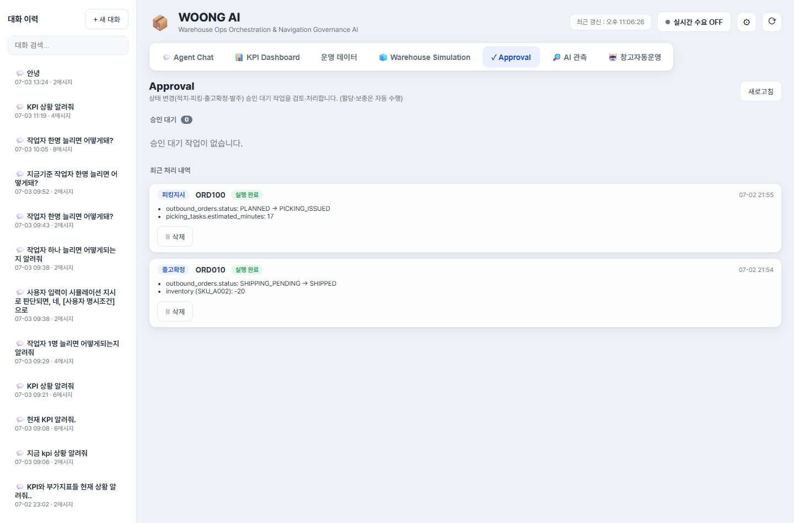

## 7.1 화면 구성

Approval 화면은 다음 영역으로 구성된다.

| 영역 | 설명 |
|---|---|
| 화면 제목 영역 | Approval 화면 설명과 `새로고침` 버튼이 표시된다. |
| 승인 대기 | 아직 승인 또는 거절되지 않은 Draft 목록이다. |
| 최근 처리 내역 | 실행 완료 또는 거절된 Draft 이력이다. |

승인 대기 건수는 `승인 대기` 제목 옆에 숫자로 표시된다.

## 7.2 Draft 유형

Approval에서 처리하는 Draft는 상태 변경 작업을 의미한다.

| Draft 유형 | 설명 |
|---|---|
| 적치지시 | 입고 건을 특정 Location에 적치하도록 작업을 생성한다. |
| 피킹지시 | 출고 주문에 대한 피킹 작업을 생성한다. |
| 출고확정 | 출고 대기 주문을 출고 완료 처리하고 재고를 차감한다. |
| 발주 | 부족 SKU에 대한 신규 입고 예정 건을 생성한다. |

Draft는 Agent Chat, 오늘 할 일 패널, 또는 관련 API 실행 과정에서 생성될 수 있다.

## 7.3 승인 대기 카드

승인 대기 목록의 각 카드는 다음 정보를 표시한다.

| 항목 | 설명 |
|---|---|
| 작업 유형 | 적치지시, 피킹지시, 출고확정, 발주 등 작업 종류 |
| 대상 ID | 주문번호, 입고번호, SKU 등 작업 대상 |
| 생성 시각 | Draft가 생성된 시각 |
| Dry-run 결과 | 승인 시 변경될 데이터와 경고 |
| 처리 버튼 | 승인, 거부, 보류 |

Dry-run 결과는 실제 실행 전에 어떤 변경이 일어나는지 보여준다. 예를 들어 출고확정 Draft라면 재고 차감 예정 SKU와 수량이 표시될 수 있고, 발주 Draft라면 생성될 입고 예정 정보가 표시될 수 있다.

## 7.4 버튼 동작

Approval 카드에는 다음 버튼이 제공된다.

| 버튼 | 동작 |
|---|---|
| 승인 | Draft를 승인하고 즉시 실행한다. 실행 후 상태가 `EXECUTED`로 변경된다. |
| 거부 | Draft를 거절한다. 상태가 `REJECTED`로 변경된다. |
| 보류 | 현재 상태를 유지한다. Draft는 승인 대기 목록에 남는다. |

승인 또는 거부 처리가 완료되면 목록이 갱신되고, 결과가 토스트 또는 카드 상태로 표시된다.

## 7.5 최근 처리 내역

최근 처리 내역에는 실행 완료 또는 거절된 Draft가 표시된다.

처리 내역에서는 다음 정보를 확인할 수 있다.

| 항목 | 설명 |
|---|---|
| 실행 완료 | 승인되어 실제 상태 변경까지 완료된 작업 |
| 거부 | 사용자가 거절한 작업 |
| 입고 대기 | 발주가 실행되었지만 아직 입고 처리되지 않은 상태 |
| 입고 완료 | 발주 이후 입고가 재고에 반영된 상태 |

최근 처리 내역은 작업 검증과 시연 후 정리 목적으로 사용된다.

## 7.6 발주 이력과 바로 보충

발주 Draft가 승인되어 실행되면 신규 입고 예정 건이 생성된다. 이 상태는 곧바로 재고가 증가한 것이 아니라 `입고 대기` 상태이다.

입고 대기 중인 발주 이력에는 `바로 보충` 버튼이 표시될 수 있다. 이 버튼을 누르면 해당 입고 예정 건을 즉시 입고 처리하여 재고에 반영한다.

| 상태 | 의미 |
|---|---|
| 입고 대기 | 발주는 생성되었지만 아직 재고에 반영되지 않았다. |
| 바로 보충 | 입고 예정 건을 즉시 입고·재고 반영 처리한다. |
| 입고 완료 | 재고에 반영되어 삭제 가능한 상태가 된다. |

이 기능은 시연이나 테스트 상황에서 발주 후 입고까지의 시간을 단축해 후속 피킹 또는 출고 흐름을 확인할 때 유용하다.

## 7.7 삭제 조건

최근 처리 내역의 일부 항목은 삭제할 수 있다.

다만 발주 실행 건의 경우 아직 입고가 완료되지 않았다면 삭제가 제한될 수 있다. 이는 입고 예정 데이터와 연결된 상태를 보호하기 위한 동작이다.

일반적인 기준은 다음과 같다.

| 항목 | 삭제 가능 여부 |
|---|---|
| 거부된 Draft | 삭제 가능 |
| 실행 완료 Draft | 삭제 가능 |
| 입고 대기 발주 | 입고 완료 전에는 삭제 제한 가능 |
| 입고 완료 발주 | 삭제 가능 |

삭제는 화면 정리 목적이며, 이미 실행된 업무의 실제 운영 결과를 되돌리는 기능은 아니다.

## 7.8 Approval 사용 시 주의사항

Approval 화면은 실제 데이터 상태를 변경할 수 있으므로 다음 사항을 확인해야 한다.

| 확인 항목 | 설명 |
|---|---|
| 작업 유형 | 적치, 피킹, 출고확정, 발주 중 어떤 작업인지 확인한다. |
| 대상 ID | 주문번호, 입고번호, SKU가 올바른지 확인한다. |
| Dry-run 변경 내용 | 승인 시 어떤 테이블과 상태가 바뀌는지 확인한다. |
| 경고 메시지 | 재고 부족, 용량 부족 등 경고가 있는지 확인한다. |
| 발주 상태 | 발주 실행과 실제 입고 완료를 구분한다. |

Approval은 Human-in-the-loop 통제 지점이다. AI가 작업을 제안하더라도 최종 상태 변경은 사용자의 승인 또는 거절을 통해 관리된다.

# 8. AI 관측 화면

AI 관측 화면은 Agent Chat에서 AI가 어떤 흐름으로 답변을 생성했는지 확인하는 화면이다. 사용자는 이 화면에서 질문의 Intent, 파라미터, Tool 실행 결과, RAG 근거, Approval 판단을 단계별로 검증할 수 있다.

이 화면은 일반 운영자가 매번 볼 필요는 없지만, AI 응답을 검증하거나 시연 중 판단 근거를 설명할 때 중요하다.

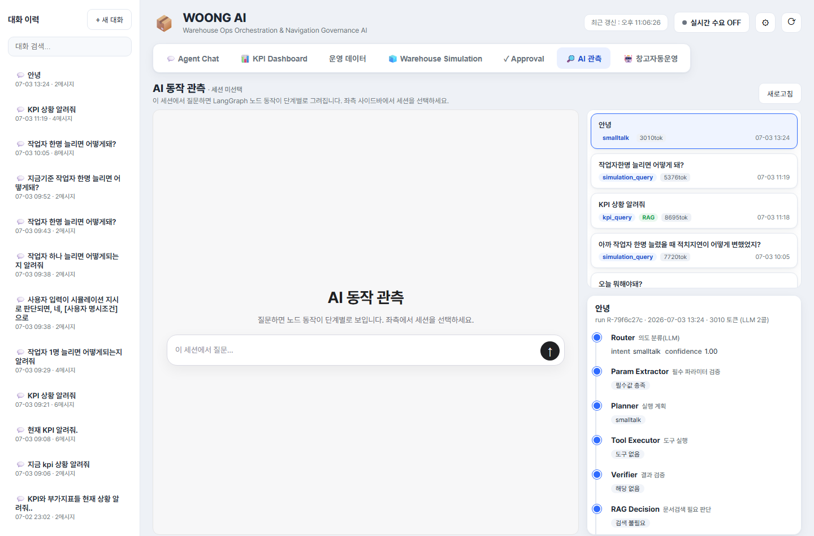

## 8.1 화면 구성

AI 관측 화면은 다음 영역으로 구성된다.

| 영역 | 설명 |
|---|---|
| 화면 제목 영역 | 현재 세션 ID와 새로고침 버튼이 표시된다. |
| Trace 전용 채팅 영역 | AI 관측 화면 안에서 직접 질문할 수 있는 입력 영역이다. |
| Trace 목록 | 선택한 세션의 최근 실행 이력이 표시된다. |
| Trace 상세 | 선택한 실행의 LangGraph 단계별 결과가 표시된다. |

좌측 사이드바에서 세션을 선택하면 해당 세션의 Trace를 조회할 수 있다. 세션이 선택되지 않았거나 실행 이력이 없으면 안내 메시지가 표시된다.

## 8.2 Trace 목록

Trace 목록에는 Agent Chat 실행 이력이 최신순으로 표시된다.

각 Trace 항목에는 다음 정보가 포함된다.

| 항목 | 설명 |
|---|---|
| 질문 | 사용자가 입력한 질문의 앞부분 |
| Intent | Router가 분류한 질문 의도 |
| RAG 배지 | 문서 검색이 수행된 경우 표시 |
| abstain 배지 | 근거 부족으로 답변을 제한한 경우 표시 |
| 승인 배지 | 승인 필요 작업이 포함된 경우 표시 |
| 토큰 수 | LLM 호출에 사용된 토큰 수 |
| 실행 시각 | Trace가 생성된 시각 |

Trace 항목을 클릭하면 우측 상세 영역에 단계별 실행 결과가 표시된다.

## 8.3 LangGraph 단계별 실행 결과

Trace 상세는 LangGraph 노드 흐름을 단계별로 표시한다.

주요 단계는 다음과 같다.

| 단계 | 확인할 내용 |
|---|---|
| Router | 질문 Intent, 신뢰도, 추출된 파라미터 |
| Param Extractor | 필수 파라미터가 충족되었는지 여부 |
| Planner | 실행 계획 |
| Tool Executor | 호출된 Tool과 실행 결과 또는 오류 |
| Verifier | 추천 결과나 계산 결과의 규칙 검증 |
| RAG Decision | 문서 검색이 필요한지 여부 |
| RAG Retriever | 검색된 근거, 충분성 점수, 재검색 횟수 |
| Response Generator | 최종 응답의 일부 |
| Approval Gate | 승인 필요 여부와 Draft ID |

이 구조를 통해 AI가 단순히 답변을 생성한 것이 아니라, 어떤 단계와 도구를 거쳐 결론에 도달했는지 확인할 수 있다.

## 8.4 Intent와 파라미터 확인

Router 단계에서는 사용자의 질문이 어떤 Intent로 분류되었는지 확인할 수 있다.

예를 들어 다음과 같이 해석될 수 있다.

| 질문 | 예상 Intent |
|---|---|
| `오늘 뭐 해야 돼?` | `daily_summary` |
| `SKU_A001 언제 소진돼?` | `inventory_risk` |
| `KPI 상황 알려줘` | `kpi_query` |
| `INB003 적치 추천해줘` | `stocking_recommendation` |
| `작업자 1명 늘리면 어떻게 돼?` | `simulation_query` |

파라미터에는 SKU, 입고번호, 주문번호, Zone ID, 날짜, 시뮬레이션 조건 등이 표시될 수 있다. 응답이 예상과 다르다면 먼저 Intent와 파라미터가 올바르게 추출되었는지 확인한다.

## 8.5 Tool 실행 결과 확인

Tool Executor 단계에서는 실제로 어떤 도구가 실행되었는지 확인한다.

대표 Tool 실행 유형은 다음과 같다.

| 유형 | 예시 |
|---|---|
| 운영 데이터 조회 | 입고 목록, 출고 목록, 재고 현황 |
| KPI 계산 | Zone 점유율, 작업팀 가동률, 지연 건수 |
| 추천 | 적치 위치 추천, 피킹 우선순위 추천 |
| 시뮬레이션 | Baseline 또는 What-if 실행 |
| Draft 생성 | 적치, 피킹, 출고확정, 발주 Draft 생성 |

Tool 실행 오류가 발생하면 Trace 상세에서 오류 메시지를 확인할 수 있다.

## 8.6 RAG 근거 확인

정책, SOP, 규칙 설명이 필요한 질문은 RAG 검색이 수행된다.

RAG Retriever 단계에서는 다음 정보를 확인할 수 있다.

| 항목 | 설명 |
|---|---|
| 검색 근거 | 검색된 문서 또는 섹션 |
| relevance | 질문과 근거의 관련도 |
| contribution | 최종 답변에 기여한 정도 |
| answerable | 검색 근거만으로 답변 가능한지 여부 |
| 충분성 점수 | 근거가 충분한지 판단한 점수 |
| 재검색 횟수 | 근거가 부족할 때 질의를 보강해 다시 검색한 횟수 |
| abstain | 근거 부족으로 답변을 제한했는지 여부 |

`abstain`이 표시되면 문서 근거가 부족하다는 뜻이다. 이 경우 AI는 정책을 임의로 만들어 답변하지 않고, 근거 부족을 안내한다.

## 8.7 Approval Gate 확인

Approval Gate 단계에서는 AI 응답에 실제 상태 변경 작업이 포함되어 있는지 확인한다.

승인 필요 작업이 있으면 다음 정보가 표시된다.

| 항목 | 설명 |
|---|---|
| 승인 필요 여부 | 상태 변경 작업이 포함되었는지 여부 |
| Draft ID | 생성된 Draft 식별자 |
| Draft 목록 | 다건 발주처럼 여러 Draft가 생성된 경우 각 Draft가 표시된다. |

Approval Gate가 `승인 필요`로 표시되면 Agent Chat 응답 안에 승인 카드가 나타나거나, Approval 탭에서 해당 Draft를 확인할 수 있다.

## 8.8 AI 관측 화면 사용 시나리오

AI 관측 화면은 다음 상황에서 사용한다.

| 상황 | 확인할 위치 |
|---|---|
| AI가 질문을 잘못 이해한 것 같을 때 | Router의 Intent와 파라미터 |
| 답변 수치가 이상할 때 | Tool Executor 결과 |
| 정책 설명의 근거가 궁금할 때 | RAG Retriever 근거 |
| 승인 카드가 왜 생겼는지 궁금할 때 | Approval Gate |
| 응답이 근거 부족으로 제한되었을 때 | RAG Retriever의 abstain |
| 시연 중 AI 흐름을 설명해야 할 때 | Trace 상세 전체 흐름 |

AI 관측 화면은 WOONG AI의 설명 가능성을 담당하는 화면이다. Agent Chat의 최종 답변만 보는 것이 아니라, 답변이 만들어진 과정을 함께 확인할 수 있다.

# 9. 실시간 수요 기능

실시간 수요 기능은 일정 주기마다 입고 또는 출고 요청을 생성해 창고 운영 흐름을 실시간으로 발생시키는 기능이다. 이 기능은 상단 상태 바에서 제어하며, 창고 자동운영 기능과 직접 연결된다.

실시간 수요가 켜져 있으면 새 입고·출고 요청이 생성되고, 해당 이벤트는 토스트 알림과 자동운영 화면의 요청 목록에 반영된다.

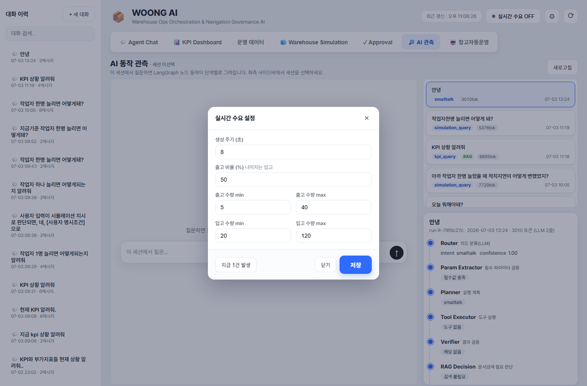

## 9.1 화면 위치

실시간 수요 기능은 화면 상단 상태 바의 우측에 있다.

| UI 요소 | 설명 |
|---|---|
| 실시간 수요 ON/OFF 버튼 | 실시간 수요 생성을 시작하거나 중지한다. |
| 설정 버튼 | 실시간 수요 생성 조건을 설정하는 모달을 연다. |
| 새로고침 버튼 | 현재 화면 데이터를 다시 불러온다. |

실시간 수요 버튼은 현재 상태에 따라 `실시간 수요 ON` 또는 `실시간 수요 OFF`로 표시된다.

## 9.2 실시간 수요 ON/OFF

`실시간 수요` 버튼을 누르면 실시간 수요 생성 상태가 전환된다.

| 상태 | 의미 |
|---|---|
| OFF | 입고·출고 요청이 자동 생성되지 않는다. |
| ON | 설정된 주기와 비율에 따라 입고·출고 요청이 자동 생성된다. |

실시간 수요가 ON이 되면 브라우저는 서버 이벤트 스트림에 연결되어 새 이벤트를 수신한다. 새 이벤트가 발생하면 화면 우측 하단에 토스트 알림이 표시된다.

## 9.3 실시간 수요 설정

설정 버튼을 누르면 `실시간 수요 설정` 모달이 열린다.

설정 항목은 다음과 같다.

| 설정값 | 설명 |
|---|---|
| 생성 주기(초) | 몇 초마다 새 요청을 생성할지 지정한다. |
| 출고 비율(%) | 생성되는 요청 중 출고 요청의 비율이다. 나머지는 입고 요청으로 생성된다. |
| 출고 수량 min | 출고 요청 생성 시 최소 수량이다. |
| 출고 수량 max | 출고 요청 생성 시 최대 수량이다. |
| 입고 수량 min | 입고 요청 생성 시 최소 수량이다. |
| 입고 수량 max | 입고 요청 생성 시 최대 수량이다. |

예를 들어 출고 비율을 70%로 설정하면 생성되는 요청 중 약 70%는 출고 요청, 나머지 30%는 입고 요청이 된다.

설정값을 변경한 뒤 `저장` 버튼을 누르면 서버 설정이 갱신된다. `닫기` 버튼이나 모달 바깥 영역을 클릭하면 설정창이 닫힌다.

## 9.4 지금 1건 발생

실시간 수요 설정 모달에는 `지금 1건 발생` 버튼이 있다.

이 버튼은 자동 주기를 기다리지 않고 즉시 입고 또는 출고 요청 1건을 생성한다. 설정된 출고 비율과 수량 범위가 즉시 생성에도 적용된다.

이 기능은 다음 상황에서 유용하다.

| 상황 | 활용 |
|---|---|
| 자동운영 시연 | 새 요청을 즉시 만들어 자동운영 흐름을 확인한다. |
| 이벤트 처리 테스트 | 토스트, 요청 목록, 자동운영 로그 반영 여부를 확인한다. |
| 특정 주기 대기 없이 검증 | 생성 주기가 길게 설정되어 있어도 즉시 1건을 발생시킨다. |

## 9.5 토스트 알림

실시간 수요가 발생하면 화면 우측 하단에 토스트 알림이 표시된다.

토스트 알림은 사용자가 현재 어느 탭을 보고 있든 표시된다. 알림에는 새 요청의 종류와 주요 정보가 포함될 수 있다.

대표적인 알림 상황은 다음과 같다.

| 상황 | 설명 |
|---|---|
| 실시간 출고 요청 생성 | 새 출고 주문 또는 출고 수요가 발생했다. |
| 실시간 입고 요청 생성 | 새 입고 예정 또는 입고 수요가 발생했다. |
| 자동운영 처리 결과 | 자동운영이 요청을 처리하거나 차단한 결과가 표시된다. |
| 오류 안내 | 실시간 수요 생성 또는 처리 중 오류가 발생했다. |

토스트는 짧게 표시되지만, 중요한 처리 결과는 자동운영 로그나 운영 데이터에도 기록된다.

## 9.6 운영 데이터와의 연결

실시간 수요로 생성된 요청은 단순 알림에 그치지 않고 운영 데이터에 반영된다.

| 요청 유형 | 반영 위치 |
|---|---|
| 입고 요청 | 운영 데이터의 입고 요청, 자동운영 요청 목록 |
| 출고 요청 | 운영 데이터의 출고 요청, 출고 요청 라인, 자동운영 요청 목록 |
| 처리 로그 | 창고 자동운영의 실시간 동작 로그, Audit Log |

실시간 수요가 ON인 상태에서 운영 데이터 화면을 보면 일부 데이터셋이 자동으로 갱신될 수 있다. 특히 자동운영 화면은 1초 단위로 상태와 로그를 갱신한다.

## 9.7 창고 자동운영과의 관계

창고 자동운영은 실시간 수요를 기반으로 동작한다. 자동운영을 시작하려면 먼저 실시간 수요가 ON이어야 한다.

자동운영 시작 조건은 다음과 같다.

| 조건 | 설명 |
|---|---|
| 실시간 수요 ON | 새 이벤트가 발생할 수 있어야 자동운영이 처리할 대상이 생긴다. |
| 자동운영 ON | Blackboard Control Loop가 주기적으로 이벤트를 수집하고 Action을 실행한다. |
| 시뮬레이션 기준 사용 | 자동운영은 시뮬레이션 기반 게이트 결과를 참고해 실행 또는 차단을 판단한다. |

실시간 수요가 OFF인 상태에서 자동운영 시작을 누르면 자동운영은 시작되지 않고 안내 토스트가 표시된다.

## 9.8 사용 시 주의사항

실시간 수요 기능은 테스트와 시연에 유용하지만, 요청을 계속 생성하므로 다음 사항을 주의해야 한다.

| 항목 | 주의사항 |
|---|---|
| 생성 주기 | 너무 짧으면 요청과 로그가 빠르게 누적된다. |
| 출고 비율 | 출고 비율이 높으면 재고 부족과 자동발주 흐름이 자주 발생한다. |
| 수량 범위 | 수량 max가 크면 품절, Zone 포화, 작업팀 과부하가 쉽게 발생할 수 있다. |
| 자동운영 연계 | 자동운영 ON 상태에서는 생성된 요청이 즉시 처리 대상이 된다. |
| 데이터 누적 | 생성된 요청과 처리 로그는 운영 데이터와 로그에 남는다. |

# 10. 창고 자동운영 화면

창고 자동운영 화면은 실시간 입고·출고 요청을 기반으로 Blackboard Agent들이 작업을 제안하고, 정책 검토와 시뮬레이션 게이트를 거쳐 자동으로 실행하는 과정을 보여준다.

이 화면은 단순히 자동운영을 켜고 끄는 화면이 아니라, 자동운영이 어떤 요청을 받았고, 어떤 Agent가 판단했으며, 어떤 Action이 어떤 순서로 실행되었는지를 관측하는 대시보드이다.

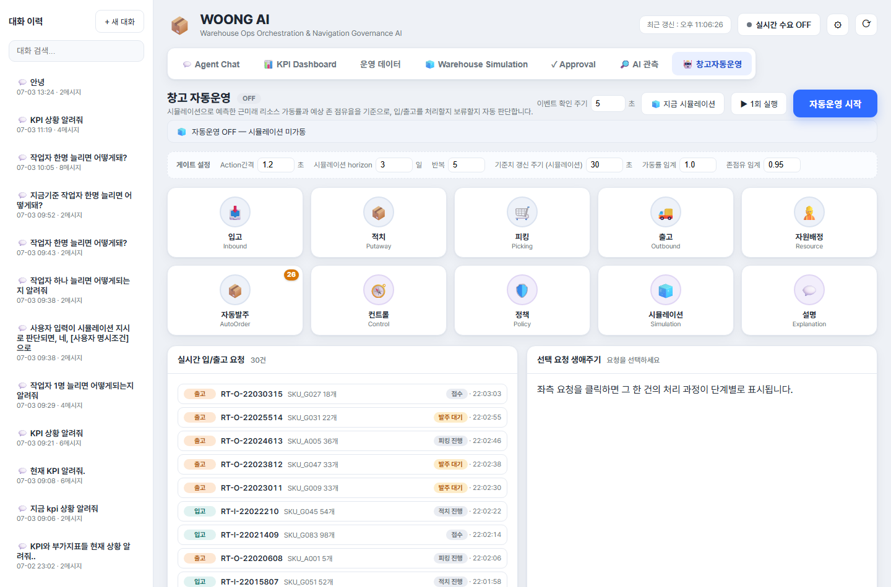

## 10.1 화면 구성

창고 자동운영 화면은 다음 영역으로 구성된다.

| 영역 | 설명 |
|---|---|
| 상단 제어 영역 | 자동운영 ON/OFF, 이벤트 확인 주기, 수동 실행 버튼을 제공한다. |
| 배치 시뮬레이션 상태 바 | 자동운영 판단에 사용되는 시뮬레이션 게이트 상태를 표시한다. |
| 게이트 설정 | 자동운영 실행 간격, 시뮬레이션 조건, 차단 임계값을 설정한다. |
| Agent 상태 영역 | 도메인 Agent와 인프라 Agent의 활동 상태를 표시한다. |
| 실시간 입/출고 요청 | 현재 처리 대상 요청 목록을 표시한다. |
| 선택 요청 생애주기 | 선택한 요청 한 건의 처리 과정을 단계별로 표시한다. |
| 실시간 동작 로그 | Blackboard 이벤트, Action 생성, 정책 검토, 실행 결과를 표시한다. |
| 단계 설명 | 생애주기 단계의 의사결정 사유를 LLM 설명으로 표시한다. |
| 작업 배정 계산 로그 | Dispatch Score 기반 배정 점수와 사유를 표시한다. |
| Zone 방문순서 계산 로그 | 피킹 경로의 TSP closed-route 계산 결과를 표시한다. |
| Action 실행 순서 로그 | 자동운영 사이클에서 Action이 실행된 순서와 결과를 표시한다. |

## 10.2 자동운영 시작 조건

자동운영을 시작하려면 실시간 수요가 먼저 켜져 있어야 한다.

자동운영 시작 조건은 다음과 같다.

| 조건 | 설명 |
|---|---|
| 실시간 수요 ON | 입고·출고 이벤트가 생성되어야 한다. |
| 자동운영 시작 버튼 클릭 | Blackboard Control Loop가 시작된다. |
| 시뮬레이션 게이트 준비 | 첫 배치 시뮬레이션이 기동되어 기준값을 준비한다. |

실시간 수요가 OFF인 상태에서 자동운영 시작을 누르면 토스트로 안내가 표시되고 자동운영은 시작되지 않는다.

## 10.3 상단 제어 영역

상단 제어 영역에는 다음 기능이 있다.

| UI 요소 | 설명 |
|---|---|
| 자동운영 상태 배지 | 현재 자동운영 상태를 `ON` 또는 `OFF`로 표시한다. |
| 이벤트 확인 주기 | Control Loop가 새 이벤트를 확인하고 처리하는 주기이다. |
| 지금 시뮬레이션 | 자동운영 ON/OFF와 무관하게 즉시 시뮬레이션을 1회 실행한다. |
| 1회 실행 | 자동운영 루프와 별개로 자동운영 사이클을 수동으로 1회 실행한다. |
| 자동운영 시작/중지 | 자동운영 루프를 시작하거나 중지한다. |

`1회 실행`은 자동운영이 꺼져 있어도 force 옵션으로 한 번 실행할 수 있다. 시연이나 디버깅에서 특정 순간의 이벤트 처리 결과를 확인할 때 유용하다.

## 10.4 배치 시뮬레이션 상태 바

배치 시뮬레이션 상태 바는 자동운영의 사전 판단 기준을 보여준다.

표시되는 정보는 다음과 같다.

| 정보 | 의미 |
|---|---|
| 작업팀 가용 상태 | 전체 작업팀 중 현재 가용한 작업팀 수 |
| 대기 피킹/적치 건수 | 처리 대기 중인 피킹·적치 작업 수 |
| 진행 중 작업 수 | 현재 실행 중인 작업 수 |
| 공간 상태 | Zone 점유율 기준 과부하 여부 |
| 출고지연/적치지연 | 시뮬레이션 기준 예상 지연 건수 |
| 기준치 갱신 카운트다운 | 다음 시뮬레이션 갱신까지 남은 시간 |

자동운영이 OFF이면 시뮬레이션은 미가동 상태로 표시된다. 단, 사용자가 `지금 시뮬레이션`을 눌러 수동 실행한 결과가 있으면 일정 시간 동안 해당 결과가 표시될 수 있다.

## 10.5 게이트 설정

게이트 설정은 자동운영의 실행 속도와 차단 기준을 조정하는 영역이다.

| 설정값 | 설명 |
|---|---|
| Action간격 | Action 하나를 처리한 뒤 다음 Action으로 넘어가기까지의 지연 시간이다. |
| 시뮬레이션 horizon | 자동운영 판단에 사용할 시뮬레이션 예측 기간이다. |
| 반복 | 시뮬레이션 반복 횟수이다. |
| 기준치 갱신 주기 | 시뮬레이션 기준값을 다시 계산하는 주기이다. |
| 가동률 임계 | 작업팀 가동률이 이 값보다 높으면 일부 Action이 차단될 수 있다. |
| 존점유 임계 | Zone 점유율이 이 값보다 높으면 공간 관련 Action이 차단될 수 있다. |

이 값들은 자동운영이 새 요청을 처리할지, 보류할지 판단하는 정책 기준으로 사용된다.

## 10.6 Agent 상태 영역

Agent 상태 영역은 자동운영에 참여하는 Agent들을 원형 아이콘으로 표시한다.

Agent는 크게 도메인 Agent와 인프라 Agent로 나뉜다.

| Agent | 구분 | 역할 |
|---|---|---|
| InboundAgent | 도메인 | 입고 이벤트를 처리하고 입고 관련 Action을 제안한다. |
| PutawayAgent | 도메인 | 적치 필요 이벤트를 처리하고 적치 Action을 제안한다. |
| PickingAgent | 도메인 | 출고 주문에 대한 피킹 Action을 제안한다. |
| OutboundAgent | 도메인 | 출고확정 등 출고 단계 Action을 제안한다. |
| ResourceAgent | 도메인 | 작업팀 배정과 자원 상태를 처리한다. |
| AutoOrderAgent | 도메인 | 부족재고 또는 결품 상황에서 자동발주를 제안한다. |
| ControlAgent | 인프라 | 이벤트 수집과 전체 사이클 진행을 담당한다. |
| PolicyAgent | 인프라 | 정책 검토와 실행 차단 여부를 담당한다. |
| SimulationAgent | 인프라 | 자동운영 판단에 필요한 시뮬레이션 게이트를 제공한다. |
| ExplanationAgent | 인프라 | 단계별 의사결정 사유를 설명한다. |

Agent가 활동하면 해당 아이콘이 일정 시간 강조 표시된다. AutoOrderAgent에는 발주 대기 건수가 배지로 표시될 수 있다.

## 10.7 실시간 입/출고 요청 목록

실시간 입/출고 요청 영역은 현재 자동운영이 처리할 수 있는 요청 목록을 보여준다.

각 요청 행에는 다음 정보가 표시된다.

| 항목 | 설명 |
|---|---|
| 요청 유형 | 입고 또는 출고 |
| 요청 ID | 입고번호 또는 출고 주문번호 |
| SKU/수량 | 요청에 포함된 SKU와 수량 |
| 상태 | 현재 처리 상태 |
| 생성 시각 | 요청이 생성된 시각 |

요청을 클릭하면 우측의 `선택 요청 생애주기` 영역에 해당 요청의 처리 단계가 표시된다.

## 10.8 선택 요청 생애주기

선택 요청 생애주기 영역은 요청 한 건이 어떤 단계를 거쳐 처리되는지 보여준다.

표시되는 단계는 요청 유형과 처리 결과에 따라 달라질 수 있다.

예를 들어 출고 요청은 다음과 같은 흐름을 가질 수 있다.

1. 출고 요청 생성
2. 재고 가용성 확인
3. 재고 할당
4. 피킹 작업 생성
5. 작업팀 배정
6. Zone 방문순서 계산
7. 피킹 완료
8. 출고확정

재고가 부족한 경우에는 `발주 대기`, `자동발주`, `바로 보충`, `주문 재개` 같은 단계가 포함될 수 있다.

각 단계는 완료, 진행, 보류, 실패, 대기 상태로 표시된다. 단계에 Action ID가 연결되어 있으면 해당 단계를 클릭해 의사결정 사유를 확인할 수 있다.

## 10.9 단계 설명

단계 설명 영역은 선택 요청 생애주기에서 특정 단계를 클릭했을 때 표시된다.

설명은 해당 Action의 판단 근거를 사람이 읽기 쉬운 문장으로 정리한다. 예를 들어 다음과 같은 내용을 확인할 수 있다.

| 설명 대상 | 예시 |
|---|---|
| 피킹 작업 생성 | 왜 이 주문이 피킹 대상으로 선택되었는지 |
| 작업팀 배정 | 어떤 점수와 조건으로 작업팀이 배정되었는지 |
| 정책 차단 | 가동률 또는 Zone 점유율 때문에 왜 차단되었는지 |
| 자동발주 | 어떤 부족 수량 때문에 발주가 필요했는지 |

이 영역은 ExplanationAgent가 담당하며, 설명 생성 중에는 Agent 상태 영역에서 설명 Agent가 활성화될 수 있다.

## 10.10 실시간 동작 로그

실시간 동작 로그는 Blackboard 자동운영의 감사 로그를 표시한다.

로그에는 다음 단계가 표시될 수 있다.

| 단계 | 의미 |
|---|---|
| 이벤트 수신 | 새 입고·출고 이벤트를 감지했다. |
| Action 생성 | Agent가 실행 후보 Action을 제안했다. |
| 정책 검토 | Policy Gate가 실행 가능 여부를 확인했다. |
| 사전검증 | 실행 전 조건을 점검했다. |
| 락 확보 | 중복 실행 방지를 위한 락을 확보했다. |
| 실행 | 실제 Action을 실행했다. |
| 사후검증 | 실행 후 상태를 확인했다. |
| 완료 | Action 처리가 종료되었다. |

로그는 최신 항목이 위쪽에 표시된다. Agent 아이콘, 단계, 메시지를 함께 보여주므로 어떤 Agent가 어떤 판단을 했는지 빠르게 확인할 수 있다.

## 10.11 작업 배정 계산 로그

작업 배정 계산 로그는 자동운영이 피킹 또는 적치 작업 후보를 어떤 점수로 평가했는지 보여준다.

주요 표시 항목은 다음과 같다.

| 항목 | 설명 |
|---|---|
| 점수 | Dispatch Score 값 |
| 유형 | 피킹·출고 또는 적치·입고 작업 구분 |
| 작업 ID | 배정 후보 작업 ID |
| Zone | 작업 대상 Zone |
| 판정 | 배정, Zone 사용 중 스킵, 작업팀 부족 스킵 등 |
| 점수 인수 | 마감 긴급도, 대기 시간, 짧은 작업 보너스, Route 단순성 등 |

이 로그는 작업팀이 왜 특정 작업에 먼저 배정되었는지 설명하는 근거이다.

## 10.12 Zone 방문순서 계산 로그

Zone 방문순서 계산 로그는 피킹 작업의 이동 경로 계산 결과를 보여준다.

피킹 대상 SKU가 여러 Zone에 흩어져 있을 때, 시스템은 방문해야 할 Zone을 추출하고 TSP closed-route 방식으로 방문순서를 계산한다.

표시되는 정보는 다음과 같다.

| 항목 | 설명 |
|---|---|
| 출처 | 자동운영(AUTO) 또는 수동 지시(HITL) |
| 작업 ID | 피킹 작업 ID |
| 주문번호 | 출고 주문번호 |
| 방문 경로 | 입구에서 시작해 Zone을 방문하고 다시 입구로 돌아오는 경로 |
| 방문 Zone 수 | 경로에 포함된 Zone 개수 |
| 거리 비용 | Zone 간 이동 비용 |
| 이동 시간 | 예상 이동 시간 |
| 작업 시간 | Zone 내 피킹 작업 시간 |
| 총 시간 | 이동 시간과 작업 시간을 합산한 예상 시간 |

이 로그는 피킹 작업의 예상 소요시간과 동선 최적화 근거를 확인할 때 사용한다.

## 10.13 Action 실행 순서 로그

Action 실행 순서 로그는 자동운영 사이클 안에서 Action이 어떤 순서로 실행되었는지 보여준다. 각 사이클은 두 단계로 구분되어 표시된다.

| 단계 | 이름 | 내용 |
|---|---|---|
| A단계 | 작업 진행 | 이미 발행된 작업을 완료 → 시작 → 팀 배정 순으로 진행한다. 자원 해제가 최우선이며 순서는 고정이다. |
| B단계 | 신규 편성 | 이벤트에 대응해 도메인 Agent가 제안한 신규 Action을 우선순위로 경합·실행한다. |

표시되는 정보는 다음과 같다.

| 항목 | 설명 |
|---|---|
| 실행 순서 | 사이클 내 실행 순번 |
| Action 유형 | 자원해제, 작업 시작, 팀 배정, 피킹 생성, 발주, 입고·적치 생성 등 |
| 우선순위 | 유형별 기본 우선순위와 조정(priority_score)의 합. `유형 base + 조정` 형태로 분해되어 표시된다. |
| 대상 ID | Action 대상 주문, 작업, SKU 등 |
| 결과 | 실행(성공), 차단(POLICY_BLOCKED, 미실행), 실패 등 |
| 사유 | 각 Action의 제안 사유와, 차단된 경우 차단 사유(예: 보관공간 과부하) |

사이클 헤더에는 실행 건수와 차단 건수가 구분되어 표시된다. 차단(POLICY_BLOCKED)은 실행되지 않은 Action이므로 실행 건수에 포함되지 않으며, 목록에서는 흐리게 표시된다.

로그 우측에는 판단 사유 설명 패널이 있다. 왼쪽에서 사이클을 클릭하면 그 사이클에 대해서만, 각 작업의 우선순위 근거(유형 base + 조정)와 차단 근거를 자연어로 풀어서 설명한다.

자동운영은 단순 생성순으로 Action을 실행하지 않는다. A단계의 자원 해제·작업 시작·팀 배정을 먼저 처리한 뒤, B단계의 신규 Action을 유형별 기본 우선순위와 조정값의 합(11.3.4)으로 정렬해 실행하며, 정책 게이트(11.3.5)에 막힌 Action은 차단으로 남는다.

## 10.14 자동운영 처리 흐름

자동운영의 기본 흐름은 다음과 같다.

1. 실시간 수요가 입고 또는 출고 이벤트를 생성한다.
2. ControlAgent가 새 이벤트를 수집한다.
3. 도메인 Agent들이 이벤트를 보고 Action 후보를 제안한다.
4. 중복 Action은 idempotency 기준으로 제거된다.
5. Action 후보는 우선순위와 점수 기준으로 정렬된다.
6. SimulationAgent와 PolicyAgent가 가동률·공간 상태를 기준으로 실행 가능 여부를 판단한다.
7. 실행 가능한 Action은 Executor가 처리한다.
8. 처리 결과는 Audit Log, Dispatch Log, Route Log, Execution Log에 기록된다.
9. 화면은 요청 목록, 생애주기, 로그를 주기적으로 갱신한다.

이 흐름의 상세 의사결정 구조와 최적화 로직은 11장에서 설명한다.

## 10.15 사용 시 주의사항

창고 자동운영 화면은 실제 운영 상태를 바꾸는 Action을 실행할 수 있으므로 다음 사항을 확인해야 한다.

| 항목 | 주의사항 |
|---|---|
| 실시간 수요 | 자동운영 시작 전 반드시 ON 상태인지 확인한다. |
| 게이트 설정 | 임계값을 너무 낮게 설정하면 많은 Action이 차단될 수 있다. |
| Action간격 | 너무 짧으면 로그가 빠르게 누적되고 처리 흐름을 관찰하기 어려울 수 있다. |
| 바로 보충 | 재고 부족 주문을 빠르게 재개할 수 있지만, 시연/테스트 목적의 즉시 입고 처리임을 이해해야 한다. |
| 수동 1회 실행 | 자동운영 루프와 별도로 강제 실행되므로 테스트 시점의 이벤트 상태를 확인하고 사용한다. |
| 로그 해석 | 하나의 요청이 여러 Agent와 Action을 거칠 수 있으므로 요청 생애주기와 로그를 함께 확인한다. |

# 11. 의사결정 구조와 최적화 로직

이 장은 WOONG AI가 질문에 답하고, 작업을 제안하며, 자동운영을 수행하는 내부 의사결정 구조를 설명한다. 앞 장들이 화면 사용법을 중심으로 설명했다면, 이 장은 각 화면 뒤에서 실제로 어떤 판단 흐름과 최적화 로직이 동작하는지 설명한다.

WOONG AI의 의사결정은 하나의 방식으로만 구성되어 있지 않다. 자연어 질문에는 LangGraph 기반 Agent Chat 흐름이 사용되고, 실시간 자동운영에는 Blackboard 기반 이벤트 처리 구조가 사용된다. 작업 배정과 피킹 경로에는 점수 기반 휴리스틱과 TSP 경로 최적화가 적용되며, 자동 실행 전에는 DES 시뮬레이션이 예측 검증 모듈로 사용된다.

따라서 이 장에서는 다음을 구분해서 이해해야 한다.

| 구분 | 적용 위치 | 성격 |
|---|---|---|
| LangGraph | Agent Chat, AI 관측 | 자연어 질문을 업무 의도로 해석하고 Tool/RAG/Approval 흐름으로 연결하는 Agent Pattern |
| Blackboard | 창고 자동운영 | 실시간 이벤트를 여러 Agent가 보고 Action 후보를 제안하는 이벤트 기반 Agent Pattern |
| Dispatch Score | 창고 자동운영, 작업 배정 계산 로그 | 피킹·적치 작업 후보를 점수화하는 휴리스틱 |
| Zone Routing/TSP | 피킹지시, 자동운영, Zone 방문순서 계산 로그 | 피킹 대상 Zone 방문순서를 계산하는 최적화 로직 |
| Simulation | Warehouse Simulation, 자동운영 게이트 | 미래 운영 상태를 예측하고 자동 실행을 보조하는 검증 모듈 |
| Approval Gate | Agent Chat, Approval | 상태 변경 작업을 사람 승인으로 통제하는 Human-in-the-loop 구조 |
| Trace/Audit | AI 관측, 자동운영 로그 | 판단 과정과 실행 결과를 검증하기 위한 설명 가능성 구조 |

## 11.1 전체 구조 개요

WOONG AI의 의사결정은 크게 네 흐름으로 나뉜다.

1. 사용자가 자연어로 질문한다.
2. 시스템이 현재 운영 데이터를 조회하거나 계산한다.
3. 필요하면 상태 변경 작업을 Draft 또는 Action으로 만든다.
4. 승인, 정책 검토, 시뮬레이션 게이트, 최적화 로직을 거쳐 실행한다.

이 흐름은 질문 기반 업무와 자동운영 업무에서 다르게 구현된다.

| 업무 흐름 | 시작점 | 주요 구조 | 결과 |
|---|---|---|---|
| Agent Chat | 사용자 자연어 질문 | LangGraph | 답변, 추천, Draft, Trace |
| 오늘 할 일 | `daily_summary` 질문 | LangGraph + Todo Tool | 4개 업무 버킷, 즉시 실행 또는 Approval 보류 |
| Approval | Draft 생성 | Approval Gate | 승인, 거절, 실행 이력 |
| 자동운영 | 실시간 이벤트 | Blackboard + Control Loop | Action 생성, 실행, Audit Log |
| 작업 배정 | 미배정 작업 | Dispatch Score | 작업팀 배정 또는 스킵 |
| 피킹 경로 | 피킹 대상 SKU | Zone Routing + TSP | Zone 방문순서, 이동/작업시간 |
| 예측 검증 | 현재 운영 데이터 | DES Simulation | Baseline, What-if, 자동운영 게이트 |

### 11.1.1 자연어 기반 의사결정: LangGraph

LangGraph는 Agent Chat에서 사용자의 질문을 단계적으로 처리하는 구조이다. 사용자의 질문을 바로 LLM 응답으로 보내지 않고, Intent 분류, 파라미터 추출, Tool 실행, RAG 검색, 승인 판단을 순차적으로 거친다.

이 구조의 목적은 다음과 같다.

| 목적 | 설명 |
|---|---|
| 질문 의도 분류 | 사용자가 KPI를 묻는지, 재고 위험을 묻는지, 작업 생성을 요청하는지 구분한다. |
| 운영 데이터 기반 답변 | LLM이 임의로 수치를 만들지 않고 Tool 결과를 근거로 답변하게 한다. |
| 문서 근거 사용 | 정책/SOP 질문은 RAG 검색 근거를 활용한다. |
| 상태 변경 통제 | 적치, 피킹, 출고확정, 발주 같은 작업은 Approval Gate로 분리한다. |
| Trace 제공 | AI 관측 화면에서 단계별 판단 결과를 확인할 수 있다. |

### 11.1.2 이벤트 기반 자동운영: Blackboard

Blackboard는 창고 자동운영 화면에서 사용되는 이벤트 기반 협업 구조이다. 실시간 수요로 생성된 입고·출고 이벤트를 여러 Agent가 보고, 각 Agent가 자신이 처리할 수 있는 Action 후보를 제안한다.

Blackboard 구조의 핵심은 다음과 같다.

| 요소 | 설명 |
|---|---|
| Event | 입고 요청, 출고 요청, 작업 생성, 작업 완료 같은 상태 변화 신호 |
| Agent | Event를 보고 자신이 처리할 Action 후보를 제안하는 도메인 로직 |
| Action | 실제 실행 가능한 업무 단위 |
| Control Loop | Event 수집, Agent 제안, Action 정렬, 실행을 반복하는 루프 |
| Audit Log | 각 단계의 판단과 실행 결과 기록 |

Blackboard에서 Agent는 직접 DB를 변경하지 않는다. Agent는 Action 후보만 제안하고, 실제 상태 변경은 Executor가 수행한다.

### 11.1.3 승인 기반 실행 통제: Approval Gate

Approval Gate는 상태 변경 작업을 사람 승인으로 통제하는 구조이다. Agent Chat에서 사용자가 `피킹지시 만들어줘`, `출고확정해줘`, `발주해줘`처럼 실제 데이터를 바꾸는 요청을 하면 시스템은 Draft를 생성하고 승인 필요 작업으로 표시한다.

Approval Gate가 필요한 이유는 다음과 같다.

| 이유 | 설명 |
|---|---|
| 재고 상태 변경 | 출고확정은 실제 재고를 차감할 수 있다. |
| 주문 상태 변경 | 피킹지시나 출고확정은 주문 상태를 바꾼다. |
| 입고 예정 생성 | 발주는 신규 입고 예정 데이터를 만든다. |
| 위치 점유 변경 | 적치지시는 Location 또는 Zone 상태에 영향을 준다. |
| 운영자 책임 판단 | AI가 제안하더라도 최종 실행은 사람이 승인해야 한다. |

### 11.1.4 예측/검증 기반 판단: Simulation

Simulation은 Agent Pattern이 아니다. Simulation은 창고 운영 상황을 DES 방식으로 예측하는 계산 모듈이다.

Simulation은 두 곳에서 사용된다.

| 사용 위치 | 역할 |
|---|---|
| Warehouse Simulation 화면 | Baseline과 What-if를 비교해 운영자 의사결정을 돕는다. |
| 창고 자동운영 | 자동 실행 전 자원 가동률과 Zone 공간 과부하를 예측해 Action 차단 여부를 판단한다. |

Simulation은 어떤 Agent가 독립적으로 의사결정하는 구조가 아니라, 운영 데이터와 설정값을 입력으로 받아 미래 KPI를 계산하는 예측·검증 로직이다.

### 11.1.5 최적화·휴리스틱 기반 배정: Dispatch, TSP, Zone Routing

자동운영은 이벤트를 받았다고 단순 FIFO로 실행하지 않는다. 실제 작업 배정에는 다음 로직이 사용된다.

| 로직 | 역할 |
|---|---|
| Dispatch Score | 피킹/적치 작업 후보 중 어떤 작업에 먼저 작업팀을 배정할지 점수화한다. |
| Zone Busy 판단 | 같은 Zone에 동시에 여러 작업이 들어가지 않도록 제어한다. |
| TSP closed-route | 피킹 대상 Zone을 어떤 순서로 방문할지 계산한다. |
| Action Priority | 자원해제, 작업시작, 팀배정, 피킹생성 등 Action 유형별 실행 우선순위를 결정한다. |

이 로직들은 Agent Pattern이라기보다 운영 최적화와 휴리스틱에 해당한다.

## 11.2 LangGraph 기반 Agent Chat 의사결정

Agent Chat은 LangGraph로 구성된 단계형 의사결정 흐름을 사용한다.

전체 흐름은 다음과 같다.

```text
START
  → Router
  → Param Extractor
  → Planner
  → Tool Executor
  → Verifier
  → RAG Decision
  → RAG Retriever(필요 시)
  → Response Generator
  → Approval Gate
  → END
```

파라미터가 부족한 경우에는 Planner로 진행하지 않고 Response Generator에서 추가 정보 요청 응답을 만든다. RAG가 필요하지 않은 질문은 RAG Retriever를 건너뛰고 바로 Response Generator로 이동한다.

### 11.2.1 Router: Intent 분류

Router는 사용자의 자연어 질문을 업무 Intent로 분류한다.

대표 Intent는 다음과 같다.

| Intent | 예시 질문 | 설명 |
|---|---|---|
| `daily_summary` | `오늘 뭐 해야 돼?` | 오늘 처리할 업무를 4개 버킷으로 요약한다. |
| `stocking_recommendation` | `INB003 적치 추천해줘` | 입고 건의 적치 위치를 추천한다. |
| `picking_recommendation` | `오늘 피킹 순서 알려줘` | 피킹 우선순위를 추천한다. |
| `inventory_risk` | `SKU_A001 언제 소진돼?` | 재고 소진 위험을 조회한다. |
| `kpi_query` | `KPI 상황 알려줘` | 운영 KPI를 조회한다. |
| `kpi_advice` | `Zone 점유율 어떻게 낮춰?` | KPI 개선 방안을 제안한다. |
| `simulation_query` | `작업자 1명 늘리면?` | 시뮬레이션 또는 What-if를 실행/설명한다. |
| `workload_estimate` | `오늘 물량 처리 가능해?` | 작업량과 처리 가능성을 추정한다. |
| `allocation_query` | `재고 부족 주문 있어?` | 출고 주문의 할당 가능성과 결품을 조회한다. |
| `order_quantity_query` | `얼마나 발주해야 해?` | 부족 SKU의 필요 발주 수량을 계산한다. |
| `order_create` | `SKU_A001 100개 발주해줘` | 발주 Draft를 생성한다. |
| `policy_question` | `왜 Zone A를 추천했어?` | 정책/SOP/RAG 근거를 사용해 설명한다. |

Router는 Intent와 함께 파라미터 후보를 추출한다. 예를 들어 `SKU_A001 언제 소진돼?`라는 질문은 `inventory_risk` Intent와 `sku=SKU_A001` 파라미터로 해석된다.

### 11.2.2 Parameter Extractor: 필수값 추출과 누락 확인

Parameter Extractor는 Intent별 필수 파라미터가 채워졌는지 확인한다.

예를 들어 다음 작업은 필수값이 필요하다.

| Intent | 필요한 값 |
|---|---|
| 적치 추천 | 입고번호 |
| 피킹지시 생성 | 주문번호 |
| 적치지시 생성 | 입고번호, Location ID |
| 출고확정 | 주문번호 |
| 발주 생성 | SKU, 수량 |

필수값이 누락되면 시스템은 Tool을 실행하지 않고 사용자에게 필요한 정보를 물어본다.

예시:

```text
다음 정보가 필요합니다: order_no
```

이 단계는 잘못된 상태 변경이나 모호한 작업 실행을 막기 위한 방어 장치이다.

### 11.2.3 Planner: 실행 계획 구성

Planner는 분류된 Intent를 기준으로 실행 계획을 구성한다. 현재 구현에서는 Intent를 중심으로 단순한 계획을 구성하지만, LangGraph 구조상 이후 여러 단계의 계획으로 확장할 수 있다.

Planner의 역할은 다음과 같다.

| 역할 | 설명 |
|---|---|
| 실행 경로 확정 | 어떤 Tool Handler를 호출할지 결정한다. |
| Trace 표시 | AI 관측 화면에서 어떤 계획이 세워졌는지 보여준다. |
| 향후 확장 지점 | 복수 Tool 실행, 조건 분기, 재시도 전략 등을 추가할 수 있다. |

### 11.2.4 Tool Executor: 업무 Tool 실행

Tool Executor는 Intent에 대응하는 실제 업무 함수를 실행한다. 이 단계에서 운영 DB 조회, KPI 계산, 추천, 시뮬레이션, Draft 생성이 수행된다.

대표 Handler는 다음과 같다.

| Handler 성격 | 수행 작업 |
|---|---|
| 조회 | 입고 목록, 출고 목록, 출고 대기, 재고 위험 조회 |
| 추천 | 적치 위치 추천, 피킹 순서 추천 |
| KPI | 운영 KPI 조회, KPI 개선 근거 조회 |
| 시뮬레이션 | Baseline 또는 What-if 실행 |
| 발주/보충 | 필요 발주 수량 계산, 발주 Draft 생성 |
| 상태 변경 | 적치지시, 피킹지시, 출고확정 Draft 생성 |
| RAG 준비 | 정책 질문에 필요한 컨텍스트 구성 |

Tool Executor는 LLM이 직접 데이터를 상상하지 않도록 하는 핵심 단계이다. 응답에 들어가는 수치와 상태는 Tool 결과를 기반으로 한다.

### 11.2.5 Verifier: 규칙 기반 검증

Verifier는 Tool 결과가 기본 규칙을 만족하는지 확인한다.

현재 주요 검증 예시는 적치 추천 결과의 점수 범위 확인이다. 추천 위치가 생성되었고 점수 breakdown이 있다면 각 점수가 정상 범위에 있는지 확인한다.

Verifier는 향후 다음 검증으로 확장될 수 있다.

| 검증 대상 | 예시 |
|---|---|
| 추천 결과 | 추천 위치가 실제 존재하는 Location인지 확인 |
| KPI 결과 | 수치 단위와 범위가 정상인지 확인 |
| Draft 결과 | Draft ID와 상태가 정상 생성되었는지 확인 |
| 시뮬레이션 결과 | 필수 KPI가 누락되지 않았는지 확인 |

### 11.2.6 RAG Decision/Retriever: 문서 근거 검색

RAG Decision은 질문에 문서 근거가 필요한지 판단한다. 정책, SOP, 추천 사유, 계산 기준을 묻는 질문은 RAG 대상이 된다.

RAG Retriever는 문서를 검색하고, 검색된 근거가 답변에 충분한지 평가한다.

RAG 단계에서 확인하는 정보는 다음과 같다.

| 항목 | 설명 |
|---|---|
| 검색 후보 | 질문과 관련 있는 문서 조각 |
| 관련도 | 질문과 검색 결과의 유사도 |
| 기여도 | 최종 답변에 얼마나 기여할 수 있는지 |
| 충분성 | 근거만으로 답변 가능한지 여부 |
| 재검색 | 근거가 부족할 때 질의를 보강해 다시 검색 |
| abstain | 근거가 부족하면 임의 답변을 제한 |

이 구조는 정책 질문에서 근거 없는 답변을 줄이기 위한 장치이다.

### 11.2.7 Response Generator: 최종 응답 생성

Response Generator는 Tool 결과, RAG 근거, 이전 대화 맥락을 사용해 최종 답변을 만든다.

응답 생성 시 지켜야 하는 원칙은 다음과 같다.

| 원칙 | 설명 |
|---|---|
| 결론 우선 | 사용자가 바로 이해할 수 있도록 핵심 결론을 먼저 제시한다. |
| 수치 근거 포함 | KPI, 재고, 지연, 발주 수량 등은 Tool 결과를 기반으로 제시한다. |
| 과장 금지 | 근거가 부족한 정책 질문은 근거 부족을 안내한다. |
| 상태 변경 명시 | 실행이 필요한 작업은 승인 필요 여부를 명확히 안내한다. |
| 이전 대화 활용 | 같은 세션의 직전 질문과 맥락을 참고한다. |

### 11.2.8 Approval Gate: 승인 필요 여부 판단

Approval Gate는 최종 응답 이후 상태 변경 작업이 포함되어 있는지 확인한다.

승인 필요 Intent는 다음 유형이다.

| 유형 | 예시 |
|---|---|
| 발주 생성 | SKU 발주 Draft 생성 |
| 적치지시 생성 | 특정 입고 건에 대한 적치 작업 Draft 생성 |
| 피킹지시 생성 | 특정 주문의 피킹 작업 Draft 생성 |
| 출고확정 | 출고 대기 주문의 출고확정 Draft 생성 |

Approval Gate가 승인 필요로 판단하면 응답에 Draft 카드가 표시된다. 사용자는 Agent Chat 화면에서 바로 승인하거나, 보류 후 Approval 탭에서 처리할 수 있다.

## 11.3 Blackboard 기반 자동운영 의사결정

Blackboard 기반 자동운영은 실시간 이벤트를 중심으로 여러 Agent가 협력하는 구조이다. 이 구조에서는 Agent가 직접 상태를 바꾸지 않고, Action 후보를 제안한다. 실제 상태 변경은 Executor가 담당한다.

전체 흐름은 다음과 같다.

```text
실시간 이벤트 생성
  → Control Loop가 NEW 이벤트 수집
  → Agent Registry 순회
  → 각 Agent가 Action 후보 제안
  → Action 중복 방지
  → Action 우선순위 정렬
  → Simulation Gate/Policy 검토
  → Executor 실행
  → 후속 Event 생성
  → Audit/Execution Log 기록
```

### 11.3.1 Event 수집

자동운영은 `NEW` 상태의 이벤트를 수집하는 것으로 시작한다.

이벤트는 다음 경로로 생성될 수 있다.

| 이벤트 출처 | 설명 |
|---|---|
| 실시간 수요 | 새 입고·출고 요청 발생 |
| Executor 후속 이벤트 | 입고 처리 후 적치 필요, 피킹 생성 후 작업팀 배정 필요 등 |
| 자동발주/백오더 처리 | 재고 부족으로 발주 대기 상태가 발생하거나 재개됨 |
| 수동 API | 테스트 또는 시연 목적으로 이벤트 생성 |

Control Loop는 이벤트를 `PROCESSING` 상태로 바꾸고 Audit Log에 `이벤트 수신`을 기록한다.

### 11.3.2 Agent별 Action 후보 생성

자동운영에는 다음 Agent들이 등록되어 있다.

| Agent | 주요 역할 |
|---|---|
| InboundAgent | 입고 이벤트를 보고 입고 처리 Action을 제안한다. |
| PutawayAgent | 입고 완료 이벤트를 보고 적치 작업 Action을 제안한다. |
| PickingAgent | 출고 이벤트를 보고 피킹 작업 Action을 제안한다. |
| OutboundAgent | 피킹 완료 이벤트를 보고 출고확정 Action을 제안한다. |
| ResourceAgent | 작업 생성 이벤트를 보고 작업팀 배정 Action을 제안한다. |
| AutoOrderAgent | 재고 부족 상황에서 발주 Action을 제안한다. |

등록 순서는 다음 흐름을 반영한다.

```text
입고 → 적치 → 피킹 → 출고 → 자원배정 → 자동발주
```

Agent는 `handles(event_type)`로 자신이 처리할 이벤트인지 판단하고, 처리 가능하면 `propose(event)`로 Action 후보를 반환한다.

### 11.3.3 Idempotency 기반 중복 방지

자동운영은 같은 이벤트가 여러 번 처리되거나, 같은 작업을 중복 생성하는 문제를 방지해야 한다. 이를 위해 Action 생성 시 `idempotency_key`를 사용한다.

같은 `idempotency_key`를 가진 Action이 이미 다음 상태 중 하나라면 새 Action은 생성되지 않는다.

| 중복 방지 대상 상태 |
|---|
| `PENDING` |
| `READY` |
| `RUNNING` |
| `SUCCESS` |

중복이 감지되면 `SKIPPED_DUPLICATE`로 처리된다.

이 방식은 다음 문제를 막는다.

| 문제 | 설명 |
|---|---|
| 같은 주문의 피킹 작업 중복 생성 | 이미 피킹 작업이 있으면 새로 만들지 않는다. |
| 같은 입고 건의 적치 작업 중복 생성 | 동일 입고번호에 대해 중복 적치를 막는다. |
| 같은 Action의 동시 실행 | Lock과 함께 중복 실행을 방지한다. |

### 11.3.4 우선순위 정렬

Action 후보는 단순 생성순으로 실행되지 않는다. Action 유형별 기본 우선순위와 후보별 점수를 합산해 실행 순서를 정한다.

기본 우선순위는 다음과 같다.

| Action 유형 | 기본 우선순위 | 의미 |
|---|---:|---|
| `FINISH_ZONE_LEG` | 100 | 진행 중인 Zone 작업 완료 및 자원 해제 |
| `START_ZONE_WORK` | 90 | 배정된 작업의 Zone 작업 시작 |
| `ALLOCATE_TEAM` | 80 | 작업팀 배정 |
| `CREATE_PICKING_TASK` | 70 | 피킹 작업 생성 |
| `REPRIORITIZE_PICKING_TASK` | 65 | 피킹 우선순위 변경 |
| `CREATE_SHIPPING_TASK` | 60 | 출고확정 대기 작업 생성 |
| `PLACE_REPLENISHMENT_ORDER` | 55 | 부족분 발주 |
| `CREATE_PUTAWAY_TASK` | 50 | 적치 작업 생성 |
| `CREATE_INBOUND_TASK` | 40 | 입고 처리 |

실제 실행 우선순위는 다음과 같다.

```text
effective_priority = action_type_base_priority + priority_score
```

같은 우선순위에서는 `idempotency_key` 또는 `target_id`를 기준으로 결정론적으로 정렬한다.

`priority_score`는 Action을 제안한 Agent가 정한 조정값이며, **각 Action 유형은 특정 Agent가 고정적으로 제안**하되 **조정값은 모두 상황에 따라 동적으로 산출**된다(Dispatch Score와 같은 스타일: 각 factor 0~1 정규화 후 가중합, **가중치 합 = 상한**). 유형별 산식은 다음과 같다.

| Action 유형 | 제안 Agent | priority_score(조정) 산식 | 상한 |
|---|---|---|---:|
| `CREATE_PICKING_TASK` | PickingAgent | `100 − 고객우선순위 × 10` | 90 |
| `REPRIORITIZE_PICKING_TASK` | OutboundAgent | `45·납기긴급 + 15·대기` | 60 |
| `CREATE_SHIPPING_TASK` | OutboundAgent | `40·납기긴급 + 15·대기` | 55 |
| `PLACE_REPLENISHMENT_ORDER` | AutoOrderAgent | `40·결품심각도 + 20·납기긴급 + 10·소진위험` | 70 |
| `CREATE_INBOUND_TASK` | InboundAgent | `30·출고필요 + 12·냉장 + 8·물량` | 50 |
| `CREATE_PUTAWAY_TASK` | PutawayAgent | `24·출고필요 + 10·냉장 + 6·물량` | 40 |
| `ALLOCATE_TEAM` | ResourceAgent / ZoneScheduler | **= Dispatch Score**(양 경로 통일) | (11.4) |

- **동적화 효과**: 통상 운영에선 생성 액션이 한 사이클에 모두 실행되므로 조정값은 실행 순서만 바꾼다. 그러나 **예산(max_actions_per_cycle) 초과·대량 폭주** 등 경합 상황에선 이 값이 실제 처리 순서를 가른다(예: 결품 심각·납기 임박 발주가 먼저).
- **상한 = 기존 고정값**: 가장 급한 인스턴스면 조정값이 상한에 근접(≈이전 고정값), 덜 급하면 낮아진다. `base + 조정 ≤ base + 상한`이라 상위 유형(자원 액션 base 80~100)을 침범하지 않는다(자원해제 최우선 보존).
- **`ALLOCATE_TEAM` 통일**: 이전엔 ResourceAgent(B단계)가 고정 30을 냈으나, 이제 **A·B 양 경로 모두 Dispatch Score**(마감긴급·대기·짧은작업·동선 / 입고경과·출고필요…)로 산출한다.
- factors 값은 exec 로그의 사유/인수에 기록되어 실행 순서 로그 설명 패널에서 검증된다.

도메인 Agent는 `[InboundAgent, PutawayAgent, PickingAgent, OutboundAgent, ResourceAgent, AutoOrderAgent]` 6종이며 각자 위 Action만 제안한다. PutawayAgent는 적치 위치가 없으면 `PUTAWAY_BLOCKED`(자동실행 불가 알림)도 낸다. A단계 자원 액션(`FINISH_ZONE_LEG`·`START_ZONE_WORK`)은 ZoneScheduler가 고정 조정값(각 50·45)으로 낸다.

예: 결품 심각도 0.6·납기 임박(1.0)·소진위험 HIGH(1.0)인 발주는 조정 `40·0.6+20·1.0+10·1.0=54`, base 55와 합쳐 실행 우선순위 109. 결품이 경미하고 납기 여유면 조정이 낮아져 뒤로 밀린다. 고객우선순위는 피킹 생성 조정에만 쓰이고 Dispatch Score(팀 배정)에는 쓰이지 않는다.

참고: 고객우선순위는 이 `priority_score`(피킹 작업을 언제 생성할지)에만 반영되고, 작업팀 배정 점수인 Dispatch Score(11.4)에는 사용되지 않는다. 두 판단은 서로 다른 단계이다.

### 11.3.5 Policy Gate 검증

자동운영은 Action을 만들었다고 바로 실행하지 않는다. 실행 전에는 두 종류의 정책 검토가 있다.

| 검토 | 설명 |
|---|---|
| Simulation Gate | DES 시뮬레이션 기반으로 자원 가동률과 Zone 과부하를 확인한다. |
| Executor Policy | Action의 위험도, lock key, 자동 실행 가능 여부를 확인한다. |

Simulation Gate는 Action 유형별로 노동 게이트와 공간 게이트를 나눠 적용한다.

| 게이트 | 대상 Action | 차단 기준 |
|---|---|---|
| 노동 게이트 | `CREATE_PICKING_TASK`, `REPRIORITIZE_PICKING_TASK`, `ALLOCATE_TEAM` | 작업팀 가동률이 임계값을 초과할 때 |
| 공간 게이트 | `CREATE_PUTAWAY_TASK`, `CREATE_INBOUND_TASK` | 대상 Zone 또는 최악 Zone 점유율이 임계값을 초과할 때 |

차단된 Action은 `POLICY_BLOCKED` 상태가 되며, 차단 사유가 Audit Log와 Action 실행 순서 로그에 남는다.

### 11.3.6 Action 실행

Action 실행은 Executor가 담당한다.

Executor의 실행 순서는 다음과 같다.

1. Action 존재 여부와 현재 상태를 확인한다.
2. 동일 idempotency key의 성공 Action이 있는지 다시 확인한다.
3. 정책 검토를 수행한다.
4. Pre-check로 최신 운영 DB 상태를 확인한다.
5. Lock을 확보한다.
6. 단일 DB 트랜잭션에서 Handler를 실행한다.
7. Post-check로 결과 반영을 확인한다.
8. 성공 시 commit, 실패 시 rollback한다.
9. 후속 이벤트를 생성한다.
10. Audit Log와 Action 상태를 갱신한다.

이 구조의 중요한 점은 실제 데이터 변경이 Executor를 통해서만 이루어진다는 것이다. Agent는 제안만 하고, Executor가 검증과 원자적 실행을 담당한다.

### 11.3.7 Audit Log 기록

자동운영의 각 단계는 Audit Log에 기록된다.

주요 Audit 단계는 다음과 같다.

| 단계 | 설명 |
|---|---|
| `EVENT_RECEIVED` | 이벤트가 수집되었다. |
| `ACTION_CREATED` | Agent가 Action 후보를 만들었다. |
| `POLICY_CHECK` | 정책 검토가 수행되었다. |
| `PRECHECK` | 실행 전 최신 상태 검증이 수행되었다. |
| `LOCK_ACQUIRED` | 실행 lock을 확보했다. |
| `EXECUTE` | Handler가 실제 작업을 실행했다. |
| `POSTCHECK` | 실행 후 상태 반영을 확인했다. |
| `FINISHED` | Action 처리가 완료되었다. |

이 로그는 창고 자동운영 화면의 실시간 동작 로그에 표시된다.

## 11.4 Dispatch Score 휴리스틱

Dispatch Score는 피킹/적치 작업 중 어떤 작업에 먼저 작업팀을 배정할지 결정하는 점수화 로직이다. 단순 FIFO가 아니라 마감 긴급도, 대기 시간, 남은 작업량, 출고 필요성과 같은 요소를 반영한다.

Dispatch Score는 창고 자동운영 화면의 `작업 배정 계산 로그`에서 확인할 수 있다.

### 11.4.1 Dispatch Score의 목적

Dispatch Score의 목적은 제한된 작업팀을 가장 필요한 작업에 먼저 배정하는 것이다.

작업팀은 작업자 2명과 지게차 1대로 구성되므로 항상 충분하지 않을 수 있다. 또한 Zone은 동시에 하나의 작업만 점유할 수 있으므로, 작업팀이 있어도 목표 Zone이 사용 중이면 배정할 수 없다.

Dispatch Score는 다음 조건을 함께 고려한다.

| 조건 | 설명 |
|---|---|
| 작업 긴급도 | 마감시간이 임박했거나 지연된 작업을 우선한다. |
| 대기 시간 | 오래 기다린 작업을 우선한다. |
| 작업 소요시간 | 짧게 끝낼 수 있는 작업에 보너스를 줄 수 있다. |
| 이동 경로 단순성 | 방문 Zone이 적은 피킹 작업을 유리하게 평가한다. |
| 출고 필요성 | 적치 작업의 경우 해당 SKU가 출고에 필요한지 고려한다. |
| Zone 사용 여부 | 목표 Zone이 이미 사용 중이면 배정하지 않는다. |
| 작업팀 가용성 | 사용 가능한 작업팀이 없으면 배정하지 않는다. |

### 11.4.2 피킹 작업 점수화 요소

피킹 작업의 Dispatch Score는 다음 요소를 사용한다.

| 요소 | 의미 | 영향 |
|---|---|---|
| 마감 긴급도 | 주문 마감까지 남은 시간과 남은 작업시간을 비교한 값 | 가장 큰 비중으로 반영된다. |
| 대기 시간 | 피킹 작업이 발행된 뒤 기다린 시간 | 오래 기다릴수록 점수가 올라간다. |
| 짧은 작업 보너스 | 남은 작업시간이 짧을수록 유리한 점수 | 빠르게 처리 가능한 작업을 우선할 수 있다. |
| Route 단순성 | 남은 방문 Zone 수가 적을수록 유리한 점수 | 동선이 단순한 작업을 빠르게 처리할 수 있다. |
| 남은 이동시간 | TSP 경로 기준 남은 이동시간 | 마감 여유 계산에 사용된다. |
| 남은 작업시간 | Zone별 작업시간 합 | 마감 여유 계산에 사용된다. |
| Slack Minutes | 마감까지 남은 시간에서 남은 작업시간을 뺀 값 | 0 이하이면 매우 긴급한 작업이다. |

피킹 점수는 개념적으로 다음 가중 구조를 가진다.

```text
피킹 Dispatch Score
  = 마감 긴급도 × 50
  + 대기 시간 × 25
  + 짧은 작업 보너스 × 15
  + Route 단순성 × 10
```

마감 긴급도는 slack이 0 이하이면 가장 높게 평가된다. slack이 충분히 크면 긴급도는 낮아진다.

### 11.4.3 적치 작업 점수화 요소

적치 작업은 피킹과 다른 기준으로 점수화된다. 적치는 출고 마감시간이 직접 연결되지 않으므로 입고 경과시간과 출고 필요성을 더 중요하게 본다.

| 요소 | 의미 | 영향 |
|---|---|---|
| 입고 경과시간 | 입고 완료 후 얼마나 오래 대기했는지 | 오래 기다릴수록 점수가 올라간다. |
| 출고 필요성 | 해당 SKU의 미처리 출고 수요가 있는지 | 출고에 필요한 SKU면 우선한다. |
| 대기 시간 | 적치 작업이 발행된 뒤 기다린 시간 | 오래 기다릴수록 점수가 올라간다. |
| 짧은 작업 보너스 | 대상 Zone 작업시간이 짧을수록 유리한 점수 | 빠른 적치를 우선할 수 있다. |

적치 점수는 개념적으로 다음 가중 구조를 가진다.

```text
적치 Dispatch Score
  = 입고 경과시간 × 45
  + 출고 필요성 × 25
  + 대기 시간 × 20
  + 짧은 작업 보너스 × 10
```

이 구조 때문에 오래 대기한 입고 건, 출고에 필요한 SKU, 빠르게 처리 가능한 적치 작업이 우선 배정된다.

### 11.4.4 작업팀 가용성 판단

Dispatch Score가 높아도 작업팀이 없으면 배정할 수 없다.

작업팀 배정은 다음 조건을 만족해야 한다.

| 조건 | 설명 |
|---|---|
| 작업 상태 | 작업이 `ISSUED` 상태여야 한다. |
| 미배정 상태 | 아직 worker_id가 없어야 한다. |
| 작업팀 존재 | 작업자 2명과 지게차 1대 조합이 가능해야 한다. |
| 대상 Zone 사용 가능 | 목표 Zone이 다른 작업에 의해 점유 중이면 안 된다. |

작업팀이 부족하면 해당 후보는 `SKIP_NO_TEAM`으로 기록된다.

### 11.4.5 Zone 사용 중 여부 판단

Zone은 동시에 하나의 작업만 점유할 수 있다. 이 제약은 적치와 피킹 모두에 적용된다.

Zone 사용 중 여부는 다음 기준으로 판단한다.

| 작업 | 현재 목표 Zone |
|---|---|
| 적치 | 적치 작업의 `zone_id` |
| 피킹 | `zone_sequence[zone_index]`에 해당하는 현재 방문 Zone |

해당 Zone에 이미 `IN_PROGRESS` 상태이며 `started_at`이 있는 작업이 있으면 Zone은 사용 중으로 판단한다.

Zone이 사용 중이면 해당 후보는 `SKIP_ZONE_BUSY`로 기록된다.

### 11.4.6 배정·스킵 사유 해석

작업 배정 계산 로그에는 후보별 판정 결과가 기록된다.

| 판정 | 의미 |
|---|---|
| `ASSIGNED` | 작업팀이 배정되었다. |
| `SKIP_ZONE_BUSY` | 목표 Zone이 사용 중이라 이번 사이클에서 제외되었다. |
| `SKIP_NO_TEAM` | 가용 작업팀이 없어 배정하지 못했다. |
| `DUP` | 같은 Action이 이미 있어 중복 생성이 생략되었다. |
| `EXEC_*` | 실행 중 특정 결과가 발생했다. |

배정이 발생한 사이클만 Dispatch 계산 이력이 저장된다. 이는 매 사이클 모든 후보를 기록해 로그가 과도하게 쌓이는 것을 막기 위한 설계이다.

## 11.5 Zone 방문순서 최적화

Zone 방문순서 최적화는 피킹 작업에서 방문해야 할 Zone의 순서를 계산하는 로직이다. 이 로직은 자동운영 피킹 생성과 수동 피킹지시 실행 모두에서 사용된다.

핵심은 `입구에서 출발해 필요한 Zone을 모두 방문한 뒤 다시 입구로 돌아오는 closed-route`를 최소 거리로 찾는 것이다.

### 11.5.1 Zone Routing의 목적

피킹 주문에는 여러 SKU가 포함될 수 있고, 각 SKU의 재고는 서로 다른 Zone에 있을 수 있다. 작업자는 이 Zone들을 방문해야 하므로 방문순서가 작업시간에 영향을 준다.

Zone Routing의 목적은 다음과 같다.

| 목적 | 설명 |
|---|---|
| 이동거리 감소 | 방문 Zone 순서를 최적화해 총 이동거리를 줄인다. |
| 예상 작업시간 계산 | 이동시간과 Zone별 작업시간을 합산해 총 소요시간을 산출한다. |
| Dispatch Score 지원 | 남은 이동시간과 남은 Zone 수를 피킹 우선순위 계산에 사용한다. |
| 설명 가능성 확보 | Zone 방문순서 계산 로그에 경로와 시간 근거를 남긴다. |

### 11.5.2 피킹 대상 SKU의 Zone 추출

Zone Routing은 먼저 피킹 대상 SKU의 재고가 있는 Zone을 찾는다.

처리 흐름은 다음과 같다.

1. 출고 주문 라인에서 SKU 목록을 추출한다.
2. 재고 테이블에서 해당 SKU의 가용 재고 위치를 찾는다.
3. Location이 속한 Zone을 추출한다.
4. 중복 Zone을 제거한다.
5. 정렬된 Zone 목록을 만든다.

결과적으로 피킹에 필요한 distinct Zone 목록이 만들어진다.

### 11.5.3 Zone 간 이동 비용 계산

Zone 간 이동 비용은 2D 창고 레이아웃의 거리 행렬을 기반으로 계산된다.

이동 비용 계산의 특징은 다음과 같다.

| 항목 | 설명 |
|---|---|
| 기준 노드 | 입구와 각 Zone |
| 거리 행렬 | 입구와 Zone 간, Zone과 Zone 간 전쌍 거리 |
| 캐시 | 좌표가 정적이므로 거리 행렬은 1회 계산 후 캐시된다. |
| 이동시간 변환 | 거리 1단위는 일정 분 단위 이동시간으로 변환된다. |

현재 구현에서는 그리드 기반 거리 행렬을 사용하며, 향후 실제 aisle graph 거리로 교체할 수 있도록 거리 계산 함수가 분리되어 있다.

### 11.5.4 TSP closed-route 방식

피킹 경로는 TSP closed-route 방식으로 계산된다.

문제 정의는 다음과 같다.

```text
입구(ENTRANCE)에서 출발
  → 필요한 Zone을 각각 한 번씩 방문
  → 다시 입구(ENTRANCE)로 복귀
```

현재 구현은 방문 Zone 수가 많지 않은 창고 구조를 전제로 완전탐색 방식으로 최단 순서를 찾는다.

완전탐색 방식의 특징은 다음과 같다.

| 특징 | 설명 |
|---|---|
| 정확한 최적해 | 가능한 모든 순열을 비교해 최소 거리 경로를 선택한다. |
| 결정성 | 같은 거리인 경우 사전순 tie-break로 항상 같은 결과를 낸다. |
| 작은 문제에 적합 | Zone 수가 제한적일 때 구현이 단순하고 결과가 명확하다. |
| 확장 여지 | Zone 수가 크게 늘면 휴리스틱 TSP 또는 graph 최단경로 방식으로 교체할 수 있다. |

### 11.5.5 수리 최적화 모델

Zone 방문순서 최적화는 수리적으로는 입구 노드에서 출발해 모든 Zone 노드를 정확히 한 번씩 방문한 뒤 다시 입구로 복귀하는 최단 closed-route를 찾는 모델로 표현할 수 있다.

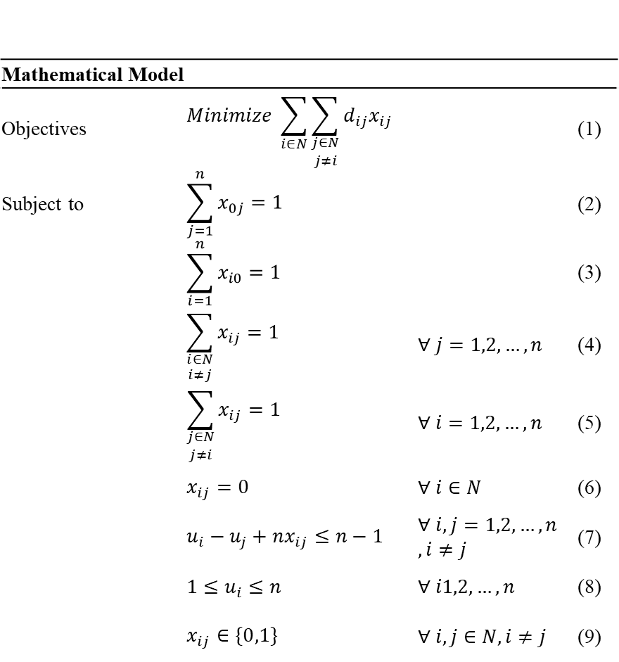

모델에서 사용하는 집합, 파라미터, 변수는 다음과 같다.

| 구분 | 기호 | 의미 |
|---|---|---|
| 집합 | `N` | 경로 문제에서 고려하는 전체 노드 집합 |
| 인덱스 | `0` | 입구 노드 |
| 인덱스 | `i, j` | 라우팅 네트워크의 노드 인덱스 |
| 파라미터 | `n` | 방문해야 하는 Zone 노드 수 |
| 파라미터 | `d_ij` | 노드 `i`에서 노드 `j`까지의 이동거리 |
| 변수 | `x_ij` | 노드 `i`에서 노드 `j`로 직접 이동하면 1, 아니면 0 |
| 변수 | `u_i` | Zone 노드 `i`의 방문 순서 |

#### 11.5.5.1 목적식: 총 이동거리 최소화

목적식은 선택된 이동 경로의 거리 합을 최소화한다.

```text
minimize  sum(i in N) sum(j in N, j != i) d_ij * x_ij
```

노드 `i`에서 노드 `j`로 직접 이동하는 경우 `x_ij = 1`이 되며, 해당 이동거리 `d_ij`가 총 이동거리에 포함된다. 따라서 모델은 입구에서 출발해 모든 Zone 노드를 방문한 뒤 다시 입구로 복귀하는 경로 중 총 이동거리가 가장 짧은 경로를 선택한다.

#### 11.5.5.2 제약식 1: 입구에서 정확히 한 번 출발

```text
sum(j = 1..n) x_0j = 1
```

경로는 입구 노드에서 반드시 한 번 출발해야 한다. 입구에서 여러 Zone으로 동시에 출발하거나, 입구에서 출발하지 않는 경로는 허용하지 않는다.

#### 11.5.5.3 제약식 2: 입구로 정확히 한 번 복귀

```text
sum(i = 1..n) x_i0 = 1
```

경로는 모든 Zone 방문 후 입구 노드로 반드시 한 번 복귀해야 한다. 입구로 여러 번 복귀하거나, 입구로 복귀하지 않는 경로는 허용하지 않는다.

#### 11.5.5.4 제약식 3: 각 Zone 노드로 정확히 한 번 진입

```text
sum(i in N, i != j) x_ij = 1    for all j = 1..n
```

각 Zone 노드는 다른 노드로부터 정확히 한 번 진입되어야 한다. 이를 통해 모든 Zone 노드가 반드시 한 번씩 방문되도록 보장한다. 특정 Zone이 누락되거나 동일한 Zone에 두 번 이상 진입하는 경우는 허용하지 않는다.

#### 11.5.5.5 제약식 4: 각 Zone 노드에서 정확히 한 번 출발

```text
sum(j in N, j != i) x_ij = 1    for all i = 1..n
```

각 Zone 노드에서는 다른 노드로 정확히 한 번 이동해야 한다. 즉, Zone을 방문한 후에는 다음 Zone으로 이동하거나 입구로 복귀해야 한다. 이 제약은 특정 Zone에서 경로가 종료되거나 하나의 Zone에서 여러 노드로 동시에 이동하는 경우를 방지한다.

#### 11.5.5.6 제약식 5: 자기 자신으로 이동 금지

```text
x_ii = 0    for all i in N
```

같은 노드에서 자기 자신으로 이동하는 경로를 허용하지 않는다. 동일 노드로 이동하는 의사결정은 실제 이동 의미가 없으므로 경로 선택 대상에서 제외한다.

PPT 수식 이미지의 제약식 (6)은 자기 자신 이동 금지 조건을 의미한다. 매뉴얼 본문에서는 의미가 명확하도록 `x_ii = 0`으로 표기한다.

#### 11.5.5.7 제약식 6: Subtour 제거

```text
u_i - u_j + n * x_ij <= n - 1    for all i, j = 1..n, i != j
```

이 제약은 입구를 포함하지 않는 별도의 부분 순환 경로가 발생하는 것을 방지한다. 예를 들어 입구와 연결된 전체 경로와 별개로 일부 Zone끼리만 순환하는 경로가 생기면, 모든 Zone의 진입·출발 조건은 만족할 수 있지만 실제 피킹 경로로는 사용할 수 없다.

방문 순서 변수 `u_i`는 각 Zone의 방문 순서를 표현한다. Subtour 제거 제약은 선택된 이동 변수 `x_ij`와 방문 순서 변수 `u_i`, `u_j`를 함께 사용해, 입구에서 출발한 하나의 연속된 경로 안에서 모든 Zone이 방문되도록 보장한다.

#### 11.5.5.8 제약식 7: 방문 순서 변수 범위

```text
1 <= u_i <= n    for all i = 1..n
```

각 Zone 노드는 1부터 `n`까지의 방문 순서를 가진다. 방문 대상 Zone이 총 `n`개이므로 첫 번째 방문 Zone은 1, 마지막 방문 Zone은 `n`의 순서를 갖는다. 입구 노드는 출발 및 복귀 지점일 뿐 방문 순서 대상에는 포함하지 않는다.

#### 11.5.5.9 제약식 8: 이동 여부 변수의 이진 조건

```text
x_ij in {0, 1}    for all i, j in N, i != j
```

노드 `i`에서 노드 `j`로 직접 이동하는지 여부를 0 또는 1로 표현한다. 해당 이동이 선택되면 1, 선택되지 않으면 0의 값을 가진다. 이를 통해 최적화 모델은 가능한 이동 경로 중 실제 사용할 경로만 선택한다.

#### 11.5.5.10 전체 모델 요약

본 모델은 입구 노드에서 출발하여 모든 Zone 노드를 각각 정확히 한 번씩 방문한 뒤 다시 입구로 복귀하는 최단 경로를 찾는 수리 최적화 모델이다.

목적은 총 이동거리를 최소화하는 것이며, 제약조건은 입구 출발 및 복귀, 각 Zone의 1회 방문, 자기 자신 이동 금지, 부분 순환 경로 방지, 변수의 정의 범위를 보장한다.

현재 애플리케이션 구현은 방문 Zone 수가 제한적인 운영 환경을 전제로 완전탐색으로 동일한 최단 경로 문제를 푼다. 즉, 화면과 로그에서 보이는 `Zone 방문순서 계산`은 위 수리모델의 목적과 제약을 운영 코드에서 계산 가능한 방식으로 구현한 결과로 이해하면 된다.

### 11.5.6 이동 시간·작업 시간·총 예상 시간 계산

경로가 정해지면 시스템은 다음 시간을 계산한다.

| 시간 | 계산 방식 |
|---|---|
| 이동 시간 | 입구→Zone→Zone→입구 경로의 거리 합을 분 단위로 변환 |
| 작업 시간 | 방문 Zone별 고정 작업시간 합 |
| 총 예상 시간 | 이동 시간 + 작업 시간 |

피킹이 여러 Zone에 걸쳐 진행되는 경우 현재 `zone_index`를 기준으로 남은 이동시간도 계산한다. 마지막 Zone에서는 입구 복귀 이동시간도 함께 반영된다.

이 값들은 다음 곳에서 사용된다.

| 사용 위치 | 설명 |
|---|---|
| 피킹 작업 생성 | 예상 작업시간과 경로를 저장한다. |
| Dispatch Score | 남은 작업시간과 slack 계산에 사용한다. |
| Zone 방문순서 계산 로그 | 경로, 이동시간, 작업시간, 총시간을 표시한다. |
| 생애주기 설명 | 작업이 어느 Zone에서 진행 중인지 설명한다. |

### 11.5.7 자동운영과 수동 피킹지시의 공통 사용

Zone Routing은 자동운영과 수동 피킹지시에서 공통으로 사용된다.

| 실행 경로 | 기록 출처 |
|---|---|
| 자동운영에서 피킹 작업 생성 | `AUTO` |
| Approval 또는 오늘 할 일에서 수동 피킹지시 실행 | `HITL` |

두 경로 모두 같은 route planning 로직을 사용하므로, 자동 실행과 사람 승인 실행의 피킹 경로 계산 기준이 일관된다.

## 11.6 Simulation 기반 의사결정 보조

Simulation은 현재 운영 데이터를 기반으로 미래 운영 상태를 예측하는 모듈이다. Agent Pattern이 아니라, 의사결정에 필요한 수치 근거를 제공하는 예측·검증 로직이다.

Simulation은 Warehouse Simulation 화면과 창고 자동운영 화면에서 서로 다른 방식으로 사용된다.

### 11.6.1 Simulation의 역할

Simulation의 역할은 다음과 같다.

| 역할 | 설명 |
|---|---|
| 미래 KPI 예측 | 현재 운영 기준으로 향후 며칠간 KPI를 예측한다. |
| What-if 비교 | 작업자, 지게차 등 조건 변경 효과를 비교한다. |
| 자동운영 게이트 | 자동 실행 전 자원·공간 과부하 여부를 판단한다. |
| 이벤트 설명 | 병목, 지연, 소진 이벤트를 Timeline으로 제공한다. |
| 의사결정 근거 | 인력 증감, 공간 과부하, 지연 위험 판단의 수치 근거가 된다. |

### 11.6.2 DES 기반 창고 운영 시뮬레이션

Simulation은 DES 기반으로 창고 운영 흐름을 모사한다.

DES는 Discrete Event Simulation, 즉 이산 사건 시뮬레이션이다. 창고 업무를 연속적인 시간 흐름이 아니라 입고, 적치, 피킹, 출고, 지연, 소진 같은 사건 단위로 처리한다.

DES가 사용하는 주요 입력은 다음과 같다.

| 입력 | 설명 |
|---|---|
| 현재 재고 | SKU별 Location별 재고 상태 |
| 입고/출고 주문 | 예정된 입고와 출고 수요 |
| 작업 리소스 | 작업자 수, 지게차 수, 작업팀 수 |
| 공정 시간 파라미터 | 입고, 적치, 피킹, 포장/출고 단계별 처리 시간 |
| Zone 용량 | Zone별 최대 수용량과 현재 점유 |
| 수요 이력 | 재고 소진과 수요 예측 근거 |

출력은 KPI, Zone 점유율 시계열, 작업 이동/상태, 병목 이벤트 등으로 저장된다.

### 11.6.3 Baseline과 What-if 비교

Warehouse Simulation 화면에서는 Baseline과 What-if를 비교한다.

| 구분 | 설명 |
|---|---|
| Baseline | 현재 운영 기준으로 실행한 시뮬레이션 |
| What-if | 작업자/지게차 증감 등 조건을 바꾼 시뮬레이션 |
| Comparison | Baseline 대비 What-if의 KPI 차이 |

What-if 결과는 운영 기준으로 바로 바뀌지 않는다. 운영자가 결과를 확인한 뒤 `이 What-if를 운영 기준으로 반영` 버튼을 눌러야 작업자/지게차 기준이 변경되고 새 Baseline이 생성된다.

### 11.6.4 자원 가동률 병목 판단

자동운영에서 Simulation은 작업팀 가동률을 기준으로 노동 병목을 판단한다.

노동 게이트의 핵심 값은 다음과 같다.

| 값 | 설명 |
|---|---|
| `resource_utilization_team` | 작업팀 가동률 |
| `util_block` | 차단 임계값 |
| `labor_ok` | 가동률이 임계값 이하인지 여부 |

가동률이 임계값을 초과하면 노동 게이트 대상 Action이 차단될 수 있다.

대상 Action은 다음과 같다.

| Action | 차단 의미 |
|---|---|
| `CREATE_PICKING_TASK` | 새 피킹 작업 생성 차단 |
| `REPRIORITIZE_PICKING_TASK` | 피킹 우선순위 변경 차단 |
| `ALLOCATE_TEAM` | 작업팀 배정 차단 |

이 차단은 자동운영이 과부하 상태에서 더 많은 작업을 밀어 넣지 않도록 하는 보호 장치이다.

### 11.6.5 Zone 공간 과부하 판단

Simulation은 Zone별 예상 점유율 피크를 계산한다.

공간 게이트의 핵심 값은 다음과 같다.

| 값 | 설명 |
|---|---|
| `zone_peak` | 시뮬레이션 기간 동안 Zone별 최대 점유율 |
| `zone_block` | Zone 점유율 차단 임계값 |
| `worst_zone` | 가장 높은 점유율을 보이는 Zone |
| `space_ok` | Zone 점유율이 임계값 이하인지 여부 |

공간 게이트 대상 Action은 다음과 같다.

| Action | 차단 의미 |
|---|---|
| `CREATE_PUTAWAY_TASK` | 적치 작업 생성 차단 |
| `CREATE_INBOUND_TASK` | 입고 처리 차단 |

적치 Action의 경우 목표 Location이 속한 Zone을 기준으로 판단한다. 입고처럼 특정 목표 Zone이 명확하지 않은 경우에는 최악 Zone 점유율을 기준으로 판단할 수 있다.

### 11.6.6 자동운영 실행 전 차단 조건으로 활용

자동운영 Control Loop는 Action 실행 전 Simulation Gate 결과를 확인한다.

처리 방식은 다음과 같다.

1. 자동운영 사이클이 시작된다.
2. 새 이벤트가 있으면 Simulation Gate를 확인한다.
3. 시뮬레이션 결과가 없고 첫 실행 중이면 이벤트를 보존하고 워밍업 대기한다.
4. 캐시된 시뮬레이션 결과가 있으면 즉시 사용한다.
5. 결과가 오래되었으면 백그라운드 갱신을 트리거한다.
6. Action 유형별로 노동 또는 공간 게이트를 적용한다.
7. 차단 대상이면 `POLICY_BLOCKED`로 기록하고 실행하지 않는다.

DES는 시간이 걸릴 수 있으므로 자동운영 사이클을 매번 블로킹하지 않는다. 대신 Simulation Agent는 결과를 캐시하고, 오래된 경우 백그라운드에서 갱신한다.

### 11.6.7 Agent Pattern과 Simulation의 차이

Simulation은 `SimulationAgent`라는 이름으로 자동운영 화면에 표시되지만, LangGraph나 Blackboard의 도메인 Agent와는 성격이 다르다.

차이는 다음과 같다.

| 항목 | Agent Pattern | Simulation |
|---|---|---|
| 입력 | 사용자 질문 또는 이벤트 | 운영 데이터, 자원 수, 시뮬레이션 설정 |
| 역할 | Action 제안, Tool 실행, 응답 생성 | 미래 상태 계산과 KPI 예측 |
| 결과 | 답변, Draft, Action 후보 | KPI, 시계열, 이벤트, 게이트 판정 |
| 실행 방식 | 단계형 또는 이벤트 기반 의사결정 | DES 계산 모듈 |
| 화면 표시 | Agent Chat, 자동운영 Agent 상태 | Simulation 화면, 자동운영 시뮬레이션 바 |

따라서 매뉴얼에서는 Simulation을 Agent Pattern이 아니라 예측/검증 모듈로 설명한다.

## 11.7 Approval Gate와 Human-in-the-loop

Approval Gate는 AI가 제안한 상태 변경 작업을 사람이 검토하고 실행 여부를 결정하도록 하는 구조이다.

이 구조는 Agent Chat과 오늘 할 일 패널, Approval 탭에 걸쳐 동작한다.

### 11.7.1 Draft 생성

Draft는 실행 전 상태 변경 작업의 초안이다.

대표 Draft는 다음과 같다.

| Draft | 생성 조건 |
|---|---|
| 적치지시 Draft | 입고 건과 추천 Location이 정해졌을 때 |
| 피킹지시 Draft | 출고 주문에 대해 피킹 작업을 만들 때 |
| 출고확정 Draft | 피킹 완료 주문을 출고 처리할 때 |
| 발주 Draft | 부족 SKU에 대해 발주 수량이 정해졌을 때 |

Draft는 `PENDING_APPROVAL` 상태로 생성된다.

### 11.7.2 Dry-run 검토

Dry-run은 실제 실행 전에 어떤 변경이 발생할지 보여주는 결과이다.

Dry-run에는 다음 정보가 포함될 수 있다.

| 정보 | 설명 |
|---|---|
| 변경 테이블 | 어떤 데이터가 변경될지 |
| 변경 필드 | 상태, 수량, 작업 생성 등 변경 대상 |
| before/after | 변경 전후 값 |
| 경고 | 재고 부족, Location 용량 부족 등 |

Dry-run은 Approval 화면에서 작업 검토의 핵심 근거가 된다.

### 11.7.3 승인 시 실행

사용자가 승인하면 다음 흐름으로 실행된다.

1. Draft 상태가 `APPROVED`로 변경된다.
2. Draft 유형에 맞는 실행 함수가 호출된다.
3. 실제 운영 데이터가 변경된다.
4. Draft 상태가 `EXECUTED`로 변경된다.
5. 실행 결과가 최근 처리 내역에 남는다.

예를 들어 피킹지시 Draft를 승인하면 재고 할당이 수행되고, 피킹 작업이 생성되며, 주문 상태가 피킹 진행 단계로 이동한다.

### 11.7.4 보류 시 Approval 대기

보류는 Draft를 삭제하거나 거절하지 않는다. Draft는 `PENDING_APPROVAL` 상태로 유지된다.

보류는 다음 상황에 유용하다.

| 상황 | 설명 |
|---|---|
| 즉시 실행하기 부담스러운 작업 | 발주, 출고확정처럼 영향이 큰 작업 |
| 추가 확인이 필요한 작업 | Dry-run 경고가 있는 작업 |
| 일괄 검토가 필요한 작업 | 오늘 할 일 패널에서 여러 항목을 모아 처리할 때 |

보류한 작업은 Approval 탭에서 다시 승인 또는 거절할 수 있다.

### 11.7.5 거절 및 처리 이력 관리

거절하면 Draft 상태는 `REJECTED`가 된다. 거절된 Draft는 최근 처리 내역에서 확인할 수 있다.

처리 완료된 이력은 삭제할 수 있지만, 삭제는 화면 정리 목적이다. 실행된 운영 결과를 되돌리는 기능은 아니다.

발주 실행 건은 입고 예정 데이터와 연결될 수 있으므로, 입고 완료 전에는 삭제가 제한될 수 있다.

## 11.8 Trace와 Audit을 통한 설명 가능성

WOONG AI는 AI 판단과 자동운영 실행 과정을 사용자가 검증할 수 있도록 Trace와 Audit 구조를 제공한다.

Trace와 Audit은 서로 다른 흐름을 관측한다.

| 구조 | 관측 대상 | 화면 |
|---|---|---|
| LangGraph Trace | Agent Chat 질문 처리 과정 | AI 관측 |
| Blackboard Audit Log | 자동운영 이벤트와 Action 처리 과정 | 창고 자동운영 |
| Dispatch 계산 로그 | 작업팀 배정 후보 점수와 판정 | 창고 자동운영 |
| Zone Route 계산 로그 | 피킹 Zone 방문순서와 시간 계산 | 창고 자동운영 |
| Action 실행 순서 로그 | 자동운영 사이클 내 실행 순서 | 창고 자동운영 |
| 단계 설명 | 특정 Action의 의사결정 사유 | 창고 자동운영 |

### 11.8.1 LangGraph Trace

LangGraph Trace는 Agent Chat 질문 하나가 어떤 단계로 처리되었는지 보여준다.

Trace에서 확인할 수 있는 내용은 다음과 같다.

| 단계 | 확인 내용 |
|---|---|
| Router | Intent, 신뢰도, 파라미터 |
| Param Extractor | 누락 파라미터 |
| Planner | 실행 계획 |
| Tool Executor | 실행된 Tool |
| Verifier | 규칙 검증 결과 |
| RAG Decision | RAG 필요 여부 |
| RAG Retriever | 검색 근거와 충분성 |
| Response Generator | 최종 응답 요약 |
| Approval Gate | 승인 필요 여부와 Draft ID |

Trace는 AI 응답이 왜 그렇게 나왔는지 확인하는 가장 직접적인 도구이다.

### 11.8.2 Blackboard Audit Log

Blackboard Audit Log는 자동운영이 이벤트를 어떻게 처리했는지 기록한다.

로그는 다음 질문에 답한다.

| 질문 | 확인 위치 |
|---|---|
| 어떤 이벤트가 들어왔는가? | `EVENT_RECEIVED` |
| 어떤 Agent가 Action을 만들었는가? | `ACTION_CREATED` |
| 왜 실행이 차단되었는가? | `POLICY_CHECK` |
| 실행 전 조건이 맞았는가? | `PRECHECK` |
| Lock은 확보되었는가? | `LOCK_ACQUIRED` |
| 실제 실행은 성공했는가? | `EXECUTE`, `FINISHED` |

### 11.8.3 Dispatch 계산 로그

Dispatch 계산 로그는 작업팀 배정 판단을 설명한다.

이 로그를 보면 다음을 확인할 수 있다.

| 확인 항목 | 설명 |
|---|---|
| 후보 작업 목록 | 같은 사이클에 평가된 피킹/적치 후보 |
| Dispatch Score | 각 후보의 점수 |
| 점수 인수 | 마감 긴급도, 대기 시간, 작업시간, 출고 필요성 |
| 최종 판정 | 배정, Zone 사용 중, 작업팀 부족 등 |

Dispatch 계산 로그는 “왜 이 작업이 먼저 배정되었는가?”에 대한 답을 제공한다.

### 11.8.4 Zone Route 계산 로그

Zone Route 계산 로그는 피킹 경로 계산을 설명한다.

이 로그를 보면 다음을 확인할 수 있다.

| 확인 항목 | 설명 |
|---|---|
| 방문 대상 Zone | 피킹 SKU가 위치한 Zone 목록 |
| 방문순서 | TSP로 계산된 최적 방문순서 |
| 이동 비용 | 입구 복귀까지 포함한 총 거리 |
| 이동 시간 | 거리 비용을 분 단위로 변환한 시간 |
| 작업 시간 | 방문 Zone별 작업시간 합 |
| 출처 | 자동운영 또는 수동 지시 |

Zone Route 로그는 피킹 예상시간과 동선 최적화의 근거이다.

### 11.8.5 Action 실행 순서 로그

Action 실행 순서 로그는 한 자동운영 사이클 안에서 Action이 어떤 순서로 실행되었는지 보여준다.

이 로그에서 중요한 점은 자원해제가 신규 배정보다 우선한다는 것이다.

자동운영 사이클의 기본 순서는 다음과 같다.

1. 완료된 Zone 작업을 먼저 `FINISH_ZONE_LEG`로 처리한다.
2. Team이 배정되어 대기 중인 작업이 Zone에 진입할 수 있으면 `START_ZONE_WORK`를 실행한다.
3. 남은 작업 중 Dispatch Score가 높은 후보부터 `ALLOCATE_TEAM`을 실행한다.
4. Event 기반 Action 후보를 우선순위 기준으로 실행한다.

이 순서 때문에 같은 사이클 안에서도 방금 완료된 작업이 자원을 해제하고, 그 자원이 즉시 다음 작업에 재사용될 수 있다.

### 11.8.6 LLM 기반 단계 설명

창고 자동운영 화면의 `단계 설명` 영역은 선택한 생애주기 단계에 대해 LLM 설명을 제공한다.

설명 대상은 다음과 같다.

| 대상 | 설명 예시 |
|---|---|
| Action 생성 | 어떤 이벤트 때문에 Action이 만들어졌는지 |
| 작업팀 배정 | 어떤 Dispatch Score와 자원 상태 때문에 배정되었는지 |
| 정책 차단 | 어떤 임계값을 초과해 차단되었는지 |
| 자동발주 | 어떤 부족 수량 때문에 발주가 필요했는지 |
| 보류/실패 | 어떤 조건이 충족되지 않아 진행되지 않았는지 |

이 기능은 숫자와 로그만으로 이해하기 어려운 판단을 자연어로 설명하기 위한 보조 장치이다.

## 11.9 판단 구조를 함께 읽는 방법

WOONG AI의 판단을 제대로 이해하려면 한 화면만 보지 않고 관련 화면을 함께 봐야 한다.

대표적인 확인 방법은 다음과 같다.

| 알고 싶은 것 | 확인 순서 |
|---|---|
| AI가 왜 이런 답변을 했는가? | Agent Chat 응답 → AI 관측 Trace |
| 작업이 왜 승인 필요로 나왔는가? | Agent Chat 승인 카드 → AI 관측 Approval Gate → Approval 탭 |
| 자동운영이 왜 작업을 실행했는가? | 요청 생애주기 → 실시간 동작 로그 → Action 실행 순서 로그 |
| 작업팀이 왜 이 작업에 배정되었는가? | 작업 배정 계산 로그 → Dispatch Score 인수 |
| 피킹 경로가 왜 이 순서인가? | Zone 방문순서 계산 로그 → TSP 경로와 이동시간 |
| 자동운영이 왜 차단했는가? | 배치 시뮬레이션 상태 바 → 실시간 동작 로그의 정책 검토 |
| 인력/장비를 늘리면 개선되는가? | KPI Dashboard → Warehouse Simulation What-if → 7일 추이 |

이 장의 핵심은 WOONG AI가 단순히 LLM으로 답변하는 시스템이 아니라는 점이다. 자연어 처리, 운영 데이터 조회, 승인 통제, 이벤트 기반 자동운영, 휴리스틱 배정, TSP 경로 계산, DES 시뮬레이션, Trace/Audit 검증이 결합되어 하나의 창고 운영 의사결정 흐름을 구성한다.

# 12. 주요 업무 시나리오

이 장은 WOONG AI를 실제 운영 흐름에서 어떻게 사용하는지 설명한다. 앞 장들이 화면과 내부 구조를 설명했다면, 이 장은 사용자가 자주 수행하는 업무를 시작점부터 결과 확인까지 순서대로 정리한다.

각 시나리오는 다음 관점으로 읽으면 된다.

| 관점 | 설명 |
|---|---|
| 시작 화면 | 업무를 시작하는 화면 또는 질문 |
| 주요 조작 | 사용자가 입력하거나 클릭해야 하는 것 |
| 시스템 처리 | WOONG AI가 내부에서 수행하는 판단과 실행 |
| 결과 확인 | 사용자가 최종적으로 확인해야 하는 화면 |
| 주의사항 | 실행 전후로 확인해야 할 점 |

## 12.1 오늘 처리할 작업 확인

오늘 처리할 작업 확인은 가장 기본적인 일일 운영 시작 시나리오이다.

### 12.1.1 시작

Agent Chat에서 다음과 같이 질문한다.

```text
오늘 뭐 해야 돼?
```

또는 다음과 같이 특정 영역으로 좁혀 물어볼 수 있다.

```text
입고 쪽 대기 업무만 정리해줘
```

```text
피킹 쪽 할 일 알려줘
```

### 12.1.2 시스템 처리

질문은 `daily_summary` Intent로 분류된다. 시스템은 현재 운영 데이터를 조회해 다음 4개 버킷으로 업무를 정리한다.

| 버킷 | 조회 기준 |
|---|---|
| 출고확정 대기 | 주문 상태가 `SHIPPING_PENDING`인 출고 주문 |
| 피킹지시 대기 | 주문 상태가 `PLANNED` 또는 피킹지시가 필요한 출고 주문 |
| 적치지시 대기 | 입고 상태가 `RECEIVED`인 입고 건 |
| 부족재고 발주 필요 | 현재 재고, 미처리 출고 수요, 안전재고 기준으로 발주가 필요한 SKU |

### 12.1.3 결과 확인

Agent Chat에는 요약 답변이 표시되고, 우측에 `오늘 할 일` 패널이 자동으로 열린다.

패널에서 각 항목에 대해 다음 선택을 할 수 있다.

| 선택 | 결과 |
|---|---|
| 승인 | Draft를 생성하고 즉시 실행한다. |
| 보류 | Draft를 생성하고 Approval 탭의 승인 대기로 남긴다. |
| 거절 | 현재 패널 목록에서 제외한다. |

### 12.1.4 주의사항

`승인`은 실제 상태 변경을 발생시킬 수 있다. 출고확정은 재고 차감을 일으킬 수 있고, 발주는 신규 입고 예정 데이터를 생성한다. 확신이 없으면 `보류`를 선택한 뒤 Approval 탭에서 Dry-run 결과를 확인한다.

## 12.2 적치 위치 추천 후 승인

입고가 완료된 상품을 어느 Location에 적치할지 추천받고, 적치 작업을 생성하는 시나리오이다.

### 12.2.1 시작

Agent Chat에서 다음과 같이 질문한다.

```text
INB003 적치 위치 추천해줘
```

또는 오늘 할 일 패널의 `적치지시 대기` 버킷에서 항목을 선택해 처리할 수 있다.

### 12.2.2 시스템 처리

WOONG AI는 입고번호를 기준으로 다음 정보를 확인한다.

| 확인 정보 | 설명 |
|---|---|
| 입고 SKU와 수량 | 적치해야 할 상품과 수량 |
| 보관 유형 | 냉장, 일반 등 상품 보관 조건 |
| Location 여유 용량 | 적치 가능한 공간 |
| Zone 상태 | 점유율, 보관 유형, 우선순위 |
| 출고 수요 연계 | 출고가 많은 SKU인지 여부 |

추천 결과는 적치 후보 Location과 추천 사유로 제공된다. 사용자가 적치지시 생성을 요청하면 Draft가 생성된다.

### 12.2.3 실행 방법

실행 경로는 두 가지이다.

| 경로 | 설명 |
|---|---|
| Agent Chat 승인 카드 | 응답 안의 승인 카드에서 바로 승인한다. |
| Approval 탭 | 보류 후 Approval 탭에서 Dry-run을 확인하고 승인한다. |

### 12.2.4 결과 확인

승인 후에는 다음을 확인한다.

| 화면 | 확인 항목 |
|---|---|
| Approval | Draft 상태가 `EXECUTED`인지 확인 |
| 운영 데이터 | `stocking_tasks`에 적치 작업이 생성되었는지 확인 |
| 운영 데이터 | `inbound_orders` 상태가 `STOCKING_TASK_CREATED` 또는 후속 상태로 바뀌었는지 확인 |
| 창고 자동운영 | 자동운영이 켜져 있으면 작업팀 배정과 Zone 시작 로그 확인 |

### 12.2.5 주의사항

추천 위치가 있어도 실제 실행 전 Location 용량이 바뀌면 Pre-check에서 실패할 수 있다. 이 경우 Approval 또는 자동운영 로그에서 실패 사유를 확인한다.

## 12.3 피킹지시 생성

출고 주문에 대해 피킹 작업을 생성하는 시나리오이다.

### 12.3.1 시작

Agent Chat에서 다음과 같이 질문한다.

```text
ORD005 피킹지시 만들어줘
```

또는 오늘 할 일 패널의 `피킹지시 대기`에서 항목을 승인할 수 있다.

### 12.3.2 시스템 처리

피킹지시 생성 시 다음 검증과 계산이 수행된다.

| 처리 | 설명 |
|---|---|
| 주문 상태 확인 | 주문이 `PLANNED` 또는 `ALLOCATED` 상태인지 확인 |
| 가용재고 확인 | 각 SKU의 가용재고가 주문 수량 이상인지 확인 |
| 중복 피킹 확인 | 이미 피킹 작업이 있는지 확인 |
| 재고 할당 | 주문 라인에 재고를 할당 |
| Zone Routing | 피킹 대상 SKU가 있는 Zone을 추출하고 방문순서 계산 |
| 작업 생성 | `picking_tasks`에 피킹 작업 생성 |

### 12.3.3 결과 확인

| 화면 | 확인 항목 |
|---|---|
| Approval | 피킹지시 Draft 실행 여부 |
| 운영 데이터 | `picking_tasks` 생성 여부 |
| 운영 데이터 | `outbound_orders` 상태가 `PICKING_ISSUED` 또는 후속 상태인지 확인 |
| 창고 자동운영 | Zone 방문순서 계산 로그에서 경로 확인 |
| 창고 자동운영 | 작업 배정 계산 로그에서 팀 배정 여부 확인 |

### 12.3.4 주의사항

재고가 부족하면 피킹지시 생성이 실패하거나 자동발주 흐름으로 넘어갈 수 있다. 자동운영에서는 재고 부족 출고 주문이 `AWAITING_STOCK` 상태가 되고, AutoOrderAgent가 부족분 발주를 생성할 수 있다.

## 12.4 출고확정 처리

피킹이 완료된 주문을 출고 완료로 확정하는 시나리오이다.

### 12.4.1 시작

Agent Chat에서 다음과 같이 질문한다.

```text
ORD005 출고확정해줘
```

또는 오늘 할 일 패널의 `출고확정 대기`에서 항목을 승인한다.

### 12.4.2 시스템 처리

출고확정은 다음 처리를 수행한다.

| 처리 | 설명 |
|---|---|
| 주문 상태 확인 | 주문이 출고확정 가능한 상태인지 확인 |
| 재고 차감 | 출고 라인의 SKU별 수량만큼 재고 차감 |
| 출고 라인 갱신 | `shipped_qty`, `line_status` 갱신 |
| 주문 상태 갱신 | `outbound_orders.status`를 `SHIPPED`로 변경 |
| 출고 대기 갱신 | `shipping_pending.status`를 `CONFIRMED`로 변경 |

### 12.4.3 결과 확인

| 화면 | 확인 항목 |
|---|---|
| Approval | 출고확정 Draft가 `EXECUTED`인지 확인 |
| 운영 데이터 | 출고 주문 상태가 `SHIPPED`인지 확인 |
| 운영 데이터 | 출고 라인의 `shipped_qty`와 `line_status` 확인 |
| KPI Dashboard | 출고지연 건수 변화 확인 |

### 12.4.4 주의사항

출고확정은 실제 재고 차감을 발생시킨다. Dry-run에 재고 부족 경고가 표시되면 승인 전 반드시 확인한다.

## 12.5 부족재고 발주

부족 SKU를 확인하고 필요한 수량만큼 발주하는 시나리오이다.

### 12.5.1 시작

Agent Chat에서 다음과 같이 질문한다.

```text
부족한 SKU 발주해야 해?
```

```text
SKU_A001 100개 발주해줘
```

또는 오늘 할 일 패널의 `부족재고 발주 필요` 항목에서 승인한다.

### 12.5.2 시스템 처리

발주 판단은 다음 데이터를 사용한다.

| 데이터 | 설명 |
|---|---|
| 현재 가용재고 | `inventory.status='AVAILABLE'`인 재고 |
| 미처리 출고 수요 | 아직 출고되지 않은 주문 라인 |
| 안전재고 | 상품 마스터의 safety stock |
| 입고 예정 | 이미 예정된 입고 수량과 예정일 |
| 리드타임 | SKU별 입고 리드타임 |

발주 실행 시 신규 `inbound_orders` 레코드가 생성되며 상태는 `PLANNED`가 된다.

### 12.5.3 결과 확인

| 화면 | 확인 항목 |
|---|---|
| Approval | 발주 Draft 실행 여부 |
| 운영 데이터 | `inbound_orders`에 신규 발주 입고 건 생성 여부 |
| Approval 최근 처리 내역 | 발주 건이 `입고 대기` 또는 `입고 완료`로 표시되는지 확인 |
| KPI Dashboard | 품절/소진 예상 SKU 변화는 입고 반영 후 확인 |

### 12.5.4 주의사항

발주 실행은 즉시 재고 증가가 아니다. 발주는 입고 예정 데이터를 만드는 단계이며, 실제 가용재고 증가는 입고와 적치가 완료된 후 반영된다.

시연이나 테스트에서는 Approval 탭의 `바로 보충` 버튼으로 발주 입고 건을 즉시 재고에 반영할 수 있다.

## 12.6 실시간 수요 발생 후 자동운영 처리

실시간 수요와 자동운영을 함께 사용해 입고·출고 요청이 자동으로 처리되는 과정을 확인하는 시나리오이다.

### 12.6.1 시작

1. 상단 상태 바에서 `실시간 수요`를 ON으로 전환한다.
2. 필요하면 설정 모달에서 생성 주기, 출고 비율, 수량 범위를 조정한다.
3. 창고 자동운영 탭으로 이동한다.
4. `자동운영 시작`을 누른다.

### 12.6.2 시스템 처리

자동운영은 다음 흐름으로 요청을 처리한다.

1. 실시간 수요가 입고 또는 출고 이벤트를 생성한다.
2. ControlAgent가 이벤트를 수집한다.
3. 도메인 Agent들이 Action 후보를 제안한다.
4. Simulation Gate가 자원·공간 과부하 여부를 확인한다.
5. Executor가 검증, Lock, 실행, Post-check를 수행한다.
6. 후속 이벤트가 있으면 같은 또는 다음 사이클에서 이어서 처리한다.
7. 로그와 생애주기가 화면에 반영된다.

### 12.6.3 결과 확인

| 화면 영역 | 확인 항목 |
|---|---|
| 실시간 입/출고 요청 | 새 요청이 목록에 쌓이는지 확인 |
| 선택 요청 생애주기 | 선택한 요청이 어떤 단계까지 진행되었는지 확인 |
| 실시간 동작 로그 | 이벤트 수신, Action 생성, 정책 검토, 실행 결과 확인 |
| 배치 시뮬레이션 상태 바 | 가동률 또는 공간 과부하 여부 확인 |
| 작업 배정 계산 로그 | 작업팀 배정 점수와 스킵 사유 확인 |
| Zone 방문순서 계산 로그 | 피킹 경로 계산 결과 확인 |
| Action 실행 순서 로그 | 사이클 내 Action 실행 순서 확인 |

### 12.6.4 주의사항

실시간 수요 생성 주기가 너무 짧으면 요청과 로그가 빠르게 누적된다. 자동운영 흐름을 관찰하려면 생성 주기를 너무 짧게 설정하지 않는 것이 좋다.

## 12.7 자동운영 판단 근거 확인

자동운영이 특정 작업을 실행하거나 차단한 이유를 확인하는 시나리오이다.

### 12.7.1 시작

창고 자동운영 화면에서 실시간 요청 목록 중 하나를 클릭한다.

### 12.7.2 확인 순서

| 순서 | 확인 위치 | 확인 내용 |
|---|---|---|
| 1 | 선택 요청 생애주기 | 요청이 어느 단계에서 완료, 진행, 보류, 실패되었는지 확인 |
| 2 | 단계 설명 | 특정 단계를 클릭해 LLM 기반 의사결정 사유 확인 |
| 3 | 실시간 동작 로그 | Agent, phase, 메시지 확인 |
| 4 | 작업 배정 계산 로그 | Dispatch Score와 배정/스킵 사유 확인 |
| 5 | Zone 방문순서 계산 로그 | 피킹 경로와 이동/작업시간 확인 |
| 6 | Action 실행 순서 로그 | 실제 실행 순서와 결과 확인 |
| 7 | 배치 시뮬레이션 상태 바 | 가동률·공간 과부하로 차단되었는지 확인 |

### 12.7.3 대표 해석

| 현상 | 확인할 로그 |
|---|---|
| 작업팀이 배정되지 않음 | Dispatch 계산 로그의 `SKIP_NO_TEAM` |
| 특정 Zone에 진입하지 못함 | Dispatch 계산 로그 또는 Pre-check의 `zone 사용중` |
| 피킹 작업이 차단됨 | Simulation Gate의 가동률 과부하 |
| 적치 작업이 차단됨 | Simulation Gate의 Zone 점유 과부하 |
| 같은 작업이 다시 생성되지 않음 | `SKIPPED_DUPLICATE` |

## 12.8 What-if로 작업자/지게차 증감 효과 비교

KPI가 나빠졌을 때 인력 또는 장비를 늘리면 개선되는지 검증하는 시나리오이다.

### 12.8.1 시작

KPI Dashboard에서 다음 지표를 확인한다.

| 지표 | 의심할 수 있는 문제 |
|---|---|
| 작업팀 가동률 높음 | 작업자 또는 지게차 부족 |
| 피킹 대기시간 증가 | 작업팀 부족, Zone 병목 |
| 출고지연 증가 | 피킹/출고 처리 병목 |
| 적치지연 증가 | 적치 인력 또는 공간 부족 |

### 12.8.2 실행

Warehouse Simulation 화면으로 이동해 다음을 입력한다.

| 입력 | 예시 |
|---|---|
| horizon | 7일 |
| replications | 10회 이상 |
| 작업자 증감 | `+1` |
| 지게차 증감 | `0` 또는 `+1` |

`시뮬레이션 실행`을 누르면 What-if 버전이 생성된다.

### 12.8.3 결과 확인

| 확인 위치 | 해석 |
|---|---|
| KPI 카드 | Baseline 대비 What-if 변화 확인 |
| KPI 7일 추이 | 특정 날짜의 병목이 해소되는지 확인 |
| Event Timeline | 출고지연, 적치지연, Zone 포화 이벤트 감소 여부 확인 |
| 디지털 트윈 | 작업팀 이동과 Zone 점유 변화 확인 |

### 12.8.4 운영 기준 반영

What-if 결과가 유의미하게 개선되었다면 `이 What-if를 운영 기준으로 반영` 버튼을 사용할 수 있다.

이 작업은 선택한 What-if의 작업자/지게차 수를 운영 기준에 반영하고, 새 Baseline을 다시 실행한다.

## 12.9 재고 부족 주문의 자동발주와 바로 보충

출고 주문의 재고가 부족할 때 자동발주와 바로 보충을 확인하는 시나리오이다.

### 12.9.1 발생 조건

실시간 출고 요청이 들어왔지만, 주문 라인의 SKU 가용재고가 부족하면 피킹 작업을 만들 수 없다.

이때 자동운영은 다음 흐름을 수행할 수 있다.

1. 출고 주문의 부족 SKU와 부족 수량을 계산한다.
2. AutoOrderAgent가 부족분 발주 Action을 제안한다.
3. 발주 입고 건이 `inbound_orders`에 생성된다.
4. 출고 주문 상태가 `AWAITING_STOCK`으로 변경된다.
5. 재고가 채워지면 주문이 다시 `PLANNED`로 돌아가고 피킹이 재개된다.

### 12.9.2 바로 보충

창고 자동운영 화면의 생애주기 또는 Approval 처리 내역에서 `바로 보충`을 사용할 수 있다.

`바로 보충`은 발주분을 가상으로 즉시 입고·적치 완료 처리해 재고에 반영한다. 이후 충족 가능한 `AWAITING_STOCK` 주문은 다시 `PLANNED` 상태로 돌아가고, 피킹 이벤트가 재발행된다.

### 12.9.3 주의사항

바로 보충은 실제 물류 리드타임을 기다리지 않고 재고를 반영하는 기능이다. 시연, 테스트, 예외 처리 확인에는 유용하지만 실제 운영 정책에서는 사용 권한과 기준을 명확히 해야 한다.

## 12.10 AI 답변 검증과 오류 추적

AI 응답이 예상과 다르거나 수치가 이상해 보일 때 확인하는 시나리오이다.

### 12.10.1 확인 순서

| 순서 | 화면 | 확인 항목 |
|---|---|---|
| 1 | Agent Chat | 사용자의 질문과 AI 최종 답변 확인 |
| 2 | AI 관측 | Router Intent와 파라미터 확인 |
| 3 | AI 관측 | Tool Executor에서 어떤 Tool이 실행되었는지 확인 |
| 4 | AI 관측 | RAG 근거와 충분성 확인 |
| 5 | AI 관측 | Approval Gate에서 승인 필요 판단 확인 |
| 6 | 운영 데이터 | 원천 데이터가 실제로 기대한 상태인지 확인 |

### 12.10.2 대표 원인

| 현상 | 가능한 원인 |
|---|---|
| 다른 업무로 분류됨 | Router Intent가 예상과 다르게 분류됨 |
| 특정 SKU/주문을 못 찾음 | 파라미터가 누락되었거나 ID가 잘못됨 |
| 정책 질문 답변이 제한됨 | RAG 근거가 부족해 abstain 처리됨 |
| 실행 카드가 나타남 | 상태 변경 Intent로 분류되어 Approval Gate가 작동함 |
| 수치가 기대와 다름 | 운영 데이터 기준일 또는 원천 데이터 상태가 다름 |

# 13. 용어와 상태값

이 장은 WOONG AI에서 사용하는 주요 용어, 상태값, 데이터 개념을 정리한다. 화면과 로그에는 영문 상태값이 그대로 표시되는 경우가 있으므로, 각 값의 의미를 이해하면 업무 흐름을 추적하기 쉽다.

## 13.1 기본 업무 용어

| 용어 | 설명 |
|---|---|
| SKU | 상품을 식별하는 재고 관리 단위이다. |
| LOT | 입고 묶음 또는 재고 배치를 식별하는 단위이다. |
| Zone | 창고 내 보관/작업 구역이다. |
| Location | 실제 재고가 적치되는 위치이다. |
| PICK Location | 피킹면 또는 전진재고 역할의 Location이다. |
| RESERVE Location | 보관 또는 벌크 재고 역할의 Location이다. |
| 작업팀 | 작업자 2명과 지게차 1대를 조합한 작업 단위이다. |
| 가용재고 | 현재 출고에 사용할 수 있는 `AVAILABLE` 상태 재고이다. |
| 예약재고 | 출고 주문에 할당되어 다른 주문이 사용할 수 없도록 예약된 재고이다. |
| 안전재고 | 품절 위험을 줄이기 위해 유지해야 하는 최소 재고 기준이다. |
| 리드타임 | 발주 후 입고까지 걸리는 예상 일수이다. |
| Backorder | 재고 부족으로 출고 주문이 대기 상태가 되는 흐름이다. |

## 13.2 화면/기능 용어

| 용어 | 설명 |
|---|---|
| Agent Chat | 자연어로 창고 운영 질문을 입력하고 AI 답변을 받는 화면이다. |
| KPI Dashboard | 현재 운영 KPI와 추이를 확인하는 화면이다. |
| 운영 데이터 | 원천 데이터와 로그성 데이터를 조회하는 화면이다. |
| Warehouse Simulation | Baseline과 What-if를 실행하고 비교하는 화면이다. |
| Approval | 상태 변경 Draft를 승인·거절·실행하는 화면이다. |
| AI 관측 | LangGraph Trace를 확인하는 화면이다. |
| 창고 자동운영 | Blackboard 기반 자동처리 흐름을 관측하고 제어하는 화면이다. |
| 오늘 할 일 | 일일 업무 요약 질문 시 열리는 4개 대기 버킷 패널이다. |
| Toast | 작업 결과나 실시간 이벤트를 짧게 표시하는 알림이다. |

## 13.3 Agent와 의사결정 용어

| 용어 | 설명 |
|---|---|
| LangGraph | Agent Chat 질문을 단계별로 처리하는 그래프 구조이다. |
| Router | 사용자 질문의 Intent와 파라미터를 분류하는 단계이다. |
| Intent | 사용자의 질문 의도이다. 예: KPI 조회, 재고 위험, 시뮬레이션 등 |
| Parameter Extractor | Intent 실행에 필요한 SKU, 주문번호, 입고번호 등을 확인하는 단계이다. |
| Tool Executor | 실제 운영 데이터 조회, KPI 계산, 추천, 시뮬레이션 등을 수행하는 단계이다. |
| RAG | 문서 근거를 검색해 답변에 활용하는 Retrieval-Augmented Generation 구조이다. |
| Approval Gate | 상태 변경 작업에 승인 절차가 필요한지 판단하는 단계이다. |
| Blackboard | 실시간 이벤트를 여러 Agent가 보고 Action 후보를 제안하는 자동운영 구조이다. |
| Action | 자동운영에서 실제 실행 가능한 업무 단위이다. |
| Event | 자동운영을 시작하거나 이어가게 하는 사건 신호이다. |
| Control Loop | 이벤트 수집, Agent 제안, Action 실행을 주기적으로 반복하는 루프이다. |
| Idempotency | 같은 작업이 중복 생성·실행되지 않도록 보장하는 방식이다. |
| Lock | 같은 자원이나 주문에 대한 동시 실행 충돌을 막는 실행 잠금이다. |

## 13.4 주문/입고/출고 상태값

### 13.4.1 입고 주문 상태

| 상태값 | 의미 | 주로 표시되는 위치 |
|---|---|---|
| `PLANNED` | 입고 예정 상태이다. 아직 입고 처리되지 않았다. | 운영 데이터, 자동운영 |
| `RECEIVED` | 입고 처리가 완료되었고 적치가 필요한 상태이다. | 오늘 할 일, 운영 데이터 |
| `STOCKING_TASK_CREATED` | 적치 작업이 생성된 상태이다. | 운영 데이터 |
| `STOCKED` | 적치가 완료되어 재고에 반영된 상태이다. | 운영 데이터, Approval |

입고 흐름은 일반적으로 다음과 같다.

```text
PLANNED → RECEIVED → STOCKING_TASK_CREATED → STOCKED
```

### 13.4.2 출고 주문 상태

| 상태값 | 의미 | 주로 표시되는 위치 |
|---|---|---|
| `PLANNED` | 출고 주문이 접수되었고 피킹 전 상태이다. | 오늘 할 일, 운영 데이터 |
| `ALLOCATED` | 출고 라인에 재고가 할당된 상태이다. | 운영 데이터 |
| `PICKING_ISSUED` | 피킹 작업이 생성되었거나 피킹 진행 단계이다. | 운영 데이터, 자동운영 |
| `SHIPPING_PENDING` | 피킹 완료 후 출고확정을 기다리는 상태이다. | 오늘 할 일, Approval |
| `SHIPPED` | 출고가 완료된 상태이다. | 운영 데이터, KPI |
| `AWAITING_STOCK` | 재고 부족으로 발주/보충을 기다리는 상태이다. | 창고 자동운영 |

대표 흐름은 다음과 같다.

```text
PLANNED → ALLOCATED → PICKING_ISSUED → SHIPPING_PENDING → SHIPPED
```

재고가 부족한 경우에는 다음 흐름이 추가될 수 있다.

```text
PLANNED → AWAITING_STOCK → PLANNED → PICKING_ISSUED
```

### 13.4.3 출고 라인 상태

| 상태값 | 의미 |
|---|---|
| `PLANNED` | 출고 라인이 아직 할당되지 않은 상태이다. |
| `ALLOCATED` | 요청 수량이 할당된 상태이다. |
| `PARTIAL` | 일부 수량만 할당된 상태이다. |
| `PICKED` | 피킹이 완료된 상태이다. |
| `SHIPPED` | 출고확정까지 완료된 상태이다. |

## 13.5 재고 상태값

| 상태값 | 의미 |
|---|---|
| `AVAILABLE` | 출고 또는 할당에 사용할 수 있는 가용재고이다. |
| `RESERVED` | 특정 주문이나 작업에 예약된 재고이다. |
| `CONSUMED` | 피킹 또는 출고로 사용 완료된 예약재고이다. |
| `RELEASED` | 예약이 해제된 재고이다. |

`inventory` 테이블의 기본 상태는 `AVAILABLE`이다. 예약재고는 별도 reservation 구조에서 관리되며, 피킹 완료 시 실제 재고 차감과 예약 소비가 함께 처리될 수 있다.

## 13.6 작업 상태값

피킹 작업과 적치 작업은 유사한 상태 흐름을 가진다.

| 상태값 | 의미 |
|---|---|
| `ISSUED` | 작업이 발행되었지만 아직 작업팀이 배정되지 않은 상태이다. |
| `TEAM_ASSIGNED` | 작업팀이 배정되었고 목표 Zone 진입을 기다리는 상태이다. |
| `IN_PROGRESS` | 목표 Zone에서 작업이 진행 중인 상태이다. |
| `COMPLETED` | 피킹 작업이 완료된 상태이다. |
| `STOCKED` | 적치 작업이 완료되어 재고 반영이 끝난 상태이다. |
| `CANCELLED` | 작업이 취소된 상태이다. |

피킹 작업은 여러 Zone을 방문할 수 있으므로, 한 Zone 작업이 끝나면 다음 Zone으로 넘어가며 다시 `TEAM_ASSIGNED` 상태가 될 수 있다.

## 13.7 Shipping Pending 상태값

| 상태값 | 의미 |
|---|---|
| `PENDING` | 피킹 완료 후 출고확정을 기다리는 상태이다. |
| `CONFIRMED` | 출고확정이 완료된 상태이다. |

`PENDING` 상태의 출고 대기 건은 오늘 할 일 패널의 출고확정 대기와 연결된다.

## 13.8 Approval Draft 상태값

| 상태값 | 의미 |
|---|---|
| `PENDING_APPROVAL` | 승인 대기 상태이다. |
| `APPROVED` | 승인되었고 실행 단계로 넘어간 상태이다. |
| `EXECUTED` | 실행까지 완료된 상태이다. |
| `REJECTED` | 사용자가 거절한 상태이다. |

일반적인 흐름은 다음과 같다.

```text
PENDING_APPROVAL → APPROVED → EXECUTED
```

거절 시에는 다음과 같다.

```text
PENDING_APPROVAL → REJECTED
```

보류는 별도 상태값으로 저장되지 않는다. 보류하면 Draft는 `PENDING_APPROVAL` 상태로 남아 Approval 탭에서 계속 처리할 수 있다.

## 13.9 Blackboard Event 상태값

| 상태값 | 의미 |
|---|---|
| `NEW` | 아직 처리되지 않은 이벤트이다. |
| `PROCESSING` | Control Loop가 처리 중인 이벤트이다. |
| `PROCESSED` | 관련 Action 후보 처리가 끝난 이벤트이다. |
| `FAILED` | 이벤트 처리 중 오류가 발생한 상태이다. |

이벤트는 자동운영의 시작점이다. 하나의 이벤트가 여러 Action 후보로 이어질 수 있다.

## 13.10 Blackboard Action 상태값

| 상태값 | 의미 |
|---|---|
| `PENDING` | Action이 생성되었고 실행 대기 중이다. |
| `READY` | 실행 준비 상태이다. |
| `RUNNING` | Executor가 실행 중이다. |
| `SUCCESS` | 실행이 성공했다. |
| `POLICY_BLOCKED` | 정책 또는 시뮬레이션 게이트로 차단되었다. |
| `FAILED` | Pre-check, 실행, Post-check 중 실패했다. |
| `SKIPPED_DUPLICATE` | 같은 idempotency key의 Action이 있어 중복 생략되었다. |
| `COMPENSATED` | 보상 처리된 상태이다. |

자동운영 화면에서는 이 상태들이 생애주기, 실시간 로그, Action 실행 순서 로그에 표시될 수 있다.

## 13.11 주요 Action 유형

| Action 유형 | 설명 |
|---|---|
| `CREATE_INBOUND_TASK` | 입고 예정 건을 입고 완료 상태로 처리한다. |
| `CREATE_PUTAWAY_TASK` | 적치 작업을 생성한다. |
| `CREATE_PICKING_TASK` | 피킹 작업을 생성하고 재고 예약을 수행한다. |
| `CREATE_SHIPPING_TASK` | 피킹 완료 주문을 출고확정 대기 상태로 만든다. |
| `ALLOCATE_TEAM` | 피킹/적치 작업에 작업팀을 배정한다. |
| `START_ZONE_WORK` | 배정된 작업이 목표 Zone에서 작업을 시작한다. |
| `FINISH_ZONE_LEG` | 진행 중인 Zone 작업을 완료하고 다음 단계로 이동한다. |
| `PLACE_REPLENISHMENT_ORDER` | 재고 부족분에 대한 발주 입고 건을 생성한다. |
| `REPRIORITIZE_PICKING_TASK` | 피킹 작업 우선순위를 변경한다. |

Action 유형별 기본 우선순위는 11장에서 설명한 Action Priority 기준을 따른다.

## 13.12 주요 KPI 용어

| KPI | 설명 |
|---|---|
| Zone 점유율 | Zone 최대 용량 대비 현재 재고 점유 비율이다. |
| 작업팀 가동률 | 가용 작업팀 대비 작업 부하 또는 사용률이다. |
| 출고지연 건수 | 출고가 기준 시간 또는 마감 기준을 넘긴 건수이다. |
| 적치지연 건수 | 입고 후 적치가 지연된 건수이다. |
| 피킹 대기 시간 | 피킹 작업이 시작되기 전까지 기다린 시간이다. |
| 목표 초과 Zone 수 | 설정된 점유율 목표를 초과한 Zone 개수이다. |
| 품절 SKU 수 | 재고가 0이고 수요가 있는 SKU 수이다. |
| 1주 내 소진 예상 | 현재고가 있으나 7일 안에 소진될 것으로 예상되는 SKU 수이다. |
| 재고금액 | 보유 재고 수량과 단가를 곱해 계산한 재고 가치이다. |

## 13.13 Simulation 용어

| 용어 | 설명 |
|---|---|
| DES | Discrete Event Simulation. 입고, 적치, 피킹, 출고 같은 사건 단위로 운영을 모사한다. |
| Baseline | 현재 운영 기준으로 실행한 시뮬레이션 버전이다. |
| What-if | 작업자/지게차 증감 등 조건을 바꿔 실행한 시뮬레이션 버전이다. |
| horizon | 며칠 뒤까지 예측할지 나타내는 기간이다. |
| replications | 시뮬레이션 반복 횟수이다. |
| scenario | What-if에 적용되는 조건 묶음이다. |
| movement | 디지털 트윈에 표시되는 작업팀 이동/상태 데이터이다. |
| bottleneck_events | 지연, 포화, 소진 등 시뮬레이션 중 발생한 병목 이벤트이다. |
| zone_occupancy_timeseries | 시간별 Zone 점유율 변화 데이터이다. |

## 13.14 Dispatch와 Routing 용어

| 용어 | 설명 |
|---|---|
| Dispatch Score | 작업팀 배정 우선순위를 계산하는 점수이다. |
| due urgency | 마감 긴급도이다. 피킹 작업에서 중요하다. |
| waiting age | 작업이 발행된 뒤 대기한 시간이다. |
| short job bonus | 짧게 끝낼 수 있는 작업에 부여되는 보너스이다. |
| route simplicity | 방문해야 할 Zone 수가 적을수록 높아지는 단순성 점수이다. |
| outbound need | 적치 대상 SKU가 출고 수요에 필요한 정도이다. |
| zone busy | 특정 Zone이 이미 작업 중인지 여부이다. |
| TSP | Traveling Salesman Problem. 여러 지점을 최소 거리로 방문하는 경로 문제이다. |
| closed-route | 입구에서 출발해 모든 Zone을 방문하고 다시 입구로 돌아오는 경로이다. |
| route cost | 경로의 총 거리 비용이다. |
| travel minutes | 경로 이동시간이다. |
| work minutes | Zone 내 실제 작업시간 합이다. |

## 13.15 Trace와 Audit 용어

| 용어 | 설명 |
|---|---|
| Trace | Agent Chat 질문 하나가 LangGraph에서 처리된 단계 기록이다. |
| run_id | Trace 실행 단위의 고유 ID이다. |
| Tool Log | Agent Chat에서 어떤 Tool이 실행되었는지 남기는 로그이다. |
| RAG Log | 문서 검색 질의와 검색 결과를 남기는 로그이다. |
| Audit Log | Blackboard 자동운영의 이벤트, 정책 검토, 실행 결과 로그이다. |
| Dispatch Log | 작업 배정 점수와 판정 결과 로그이다. |
| Route Log | 피킹 Zone 방문순서 계산 로그이다. |
| Execution Log | 자동운영 사이클 내 Action 실행 순서 로그이다. |
| abstain | RAG 근거가 부족해 답변을 제한한 상태이다. |
| sufficiency | 검색 근거가 답변에 충분한지 평가한 값이다. |

## 13.16 데이터셋 용어

| 데이터셋 | 설명 |
|---|---|
| `products` | 상품 마스터이다. SKU, 보관 유형, 안전재고, 단가 등을 포함한다. |
| `zones` | Zone 마스터이다. 보관 유형, 거리, 우선순위, 최대 용량을 포함한다. |
| `locations` | Location 마스터이다. Zone, 용량, 점유 수량, 역할을 포함한다. |
| `inventory` | 현재 재고 원장이다. SKU, Location, 수량, 상태를 포함한다. |
| `inbound_orders` | 입고 예정과 발주 입고 데이터를 포함한다. |
| `outbound_orders` | 출고 주문 헤더 데이터를 포함한다. |
| `outbound_order_lines` | 출고 주문의 SKU별 라인 데이터를 포함한다. |
| `shipping_pending` | 출고확정 대기 데이터를 포함한다. |
| `stocking_tasks` | 적치 작업 데이터를 포함한다. |
| `picking_tasks` | 피킹 작업 데이터를 포함한다. |
| `resources` | 작업자와 지게차 리소스 데이터를 포함한다. |
| `process_time_params` | 공정별 처리 시간 파라미터를 포함한다. |
| `demand_history` | SKU별 과거 수요 이력을 포함한다. |
| `action_drafts` | Approval Draft 데이터를 포함한다. |
| `simulation_runs` | 시뮬레이션 실행 버전과 조건을 포함한다. |
| `simulation_kpis` | 시뮬레이션 KPI 결과를 포함한다. |
| `simulation_events` | 시뮬레이션 이벤트를 포함한다. |
| `dispatch_scores` | 작업 배정 점수 계산 결과를 포함한다. |
| `zone_routes` | 피킹 Zone 방문순서 계산 결과를 포함한다. |
| `action_exec_log` | 자동운영 Action 실행 순서를 포함한다. |
